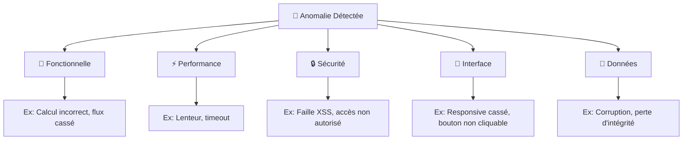
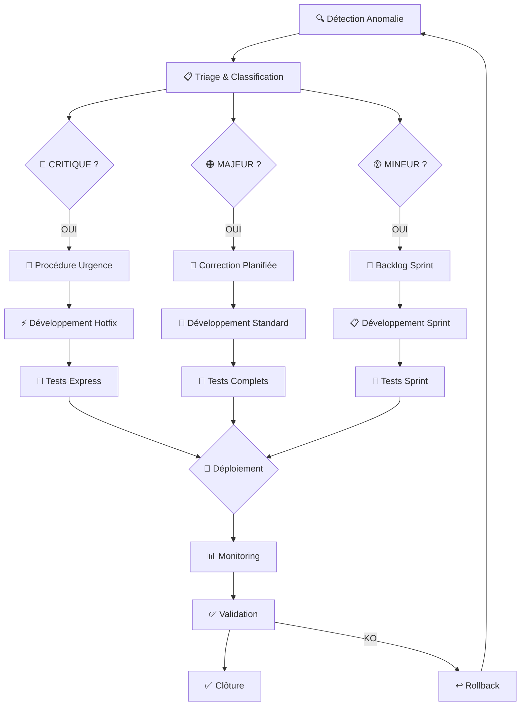

# 🛠️ Plan de Correction des Bogues - MuscuScope

> **Critère C2.3.2** - Élaborer un plan de correction des bogues à partir de l'analyse des anomalies et des régressions détectées au cours de la recette afin de garantir le fonctionnement du logiciel conformément à l'attendu.

## 🎯 Objectifs du plan de correction

Ce document définit la méthodologie et les processus pour analyser, prioriser et corriger les anomalies détectées dans MuscuScope, garantissant ainsi la qualité et la stabilité de l'application.

---

## 📊 Classification des Anomalies

### Niveaux de criticité

| Niveau | Description | Exemple | SLA Correction |
|--------|-------------|---------|----------------|
| 🔴 **CRITIQUE** | Blocage complet de l'application | Crash serveur, perte de données | **4h** |
| 🟠 **MAJEUR** | Fonctionnalité principale indisponible | Connexion impossible, API down | **24h** |
| 🟡 **MINEUR** | Dysfonctionnement partiel | Interface dégradée, lenteurs | **72h** |
| 🔵 **COSMÉTIQUE** | Problème d'affichage sans impact | Couleur incorrecte, texte mal aligné | **1 semaine** |

### Types d'anomalies



---

## 🔍 Processus d'Analyse des Anomalies

### 1. Collecte et Consignation

#### **Fiche d'Anomalie Standard**
```yaml
ID_ANOMALIE: BUG-2025-001
DATE_DETECTION: 2025-07-20T14:30:00Z
RAPPORTEUR: qa.team@muscuscope.com
CRITICITE: MAJEUR
TYPE: FONCTIONNELLE

ENVIRONNEMENT:
  - Version: 1.2.0
  - Navigateur: Chrome 126.0
  - OS: Windows 11
  - URL: https://staging.muscuscope.com/machines

DESCRIPTION:
  "La liste des machines ne se charge pas après connexion.
   Erreur 500 retournée par l'API /api/machines"

REPRODUCTION:
  1. Se connecter avec user@test.com
  2. Naviguer vers /machines
  3. Observer l'erreur 500

DONNEES_TECHNIQUES:
  - Stack trace: TypeError: Cannot read property 'length' of undefined
  - Request ID: req-789456123
  - User Agent: Mozilla/5.0...
  - IP: 192.168.1.100

IMPACT:
  - Utilisateurs affectés: Tous les utilisateurs connectés
  - Fonctionnalités bloquées: Consultation machines
  - Contournement: Aucun disponible

PIECES_JOINTES:
  - screenshot_error.png
  - network_logs.har
  - server_logs.txt
```

### 2. Analyse Technique Approfondie

#### **Grille d'Analyse RCA (Root Cause Analysis)**

```markdown
## 🔍 Analyse de l'Anomalie BUG-2025-001

### Contexte Initial
- **Quand** : Depuis le déploiement v1.2.0 (20/07/2025 12:00)
- **Où** : Environnement staging et production
- **Qui** : Tous les utilisateurs authentifiés
- **Quoi** : API /api/machines retourne 500

### Investigation Technique

#### 1. Analyse des Logs Serveur
```bash
# Symfony logs
[2025-07-20 14:30:15] request.CRITICAL: Uncaught exception 'TypeError'
at MachineController.php:45 in index()

# PostgreSQL logs  
[2025-07-20 14:30:15] ERROR: column "created_at" does not exist
LINE 1: SELECT id, name, description, created_at FROM machines
```

#### 2. Analyse du Code
```php
// Problème identifié dans MachineController
public function index(): JsonResponse
{
    // ❌ Erreur: tentative d'accès à une colonne supprimée
    $machines = $this->machineRepository->findAllWithCreatedAt();
    //                                     ^^^^^^^^^^^^^^^
    //                                     Méthode obsolète
}
```

#### 3. Analyse de la Migration
```sql
-- Migration 20250720_remove_created_at.sql (v1.2.0)
ALTER TABLE machines DROP COLUMN created_at;
-- ❌ Colonne supprimée mais code non mis à jour
```

### Cause Racine Identifiée
- **Type** : Régression lors de migration base de données
- **Origine** : Désynchronisation entre migration DB et code métier  
- **Facteur** : Tests d'intégration insuffisants sur ce flux
```

### 3. Priorisation et Impact Business

#### **Matrice d'Impact**
```markdown
| Criticité | Impact Utilisateur | Impact Business | Priorité |
|-----------|-------------------|-----------------|----------|
| CRITIQUE | 100% bloqués | Perte revenus immédiate | P0 |
| MAJEUR | 50%+ affectés | Fonctionnalité core down | P1 |
| MINEUR | <20% affectés | Dégradation UX | P2 |
| COSMÉTIQUE | Négligeable | Aucun | P3 |
```

---

## 🔧 Stratégies de Correction

### Approche par Type d'Anomalie

#### **🔴 CRITIQUE - Procédure d'Urgence**
```bash
# 1. Alerte immédiate équipe (Slack, SMS)
# 2. Rollback automatique si possible
kubectl rollout undo deployment/backend-api

# 3. Hotfix en parallèle
git checkout -b hotfix/critical-bug-fix
# Fix rapide + tests unitaires
git commit -m "hotfix: correction bug critique #BUG-2025-001"

# 4. Déploiement express
./deploy-hotfix.sh production

# 5. Validation post-correction
./validate-critical-fix.sh
```

#### **🟠 MAJEUR - Correction Planifiée**
```markdown
1. **Analyse approfondie** (2h max)
   - Root cause analysis complète
   - Impact assessment détaillé
   - Plan de correction validé

2. **Développement de la correction** (8h max)
   - Fix principal + tests de régression
   - Code review obligatoire
   - Tests automatisés étendus

3. **Déploiement staging** 
   - Validation QA complète
   - Tests de non-régression
   - Validation Product Owner

4. **Déploiement production**
   - Blue/Green deployment
   - Monitoring renforcé
   - Plan de rollback ready
```

#### **🟡 MINEUR - Cycle Normal**
```markdown
1. **Priorisation dans backlog** selon sprint planning
2. **Développement** dans le cycle normal
3. **Tests** complets selon processus standard
4. **Déploiement** avec prochaine release
```

---

## 📋 Templates de Correction

### Template Hotfix Critique

```yaml
HOTFIX_ID: HF-2025-001
ANOMALIE_SOURCE: BUG-2025-001
DEVELOPPEUR: giovanni.ricotta@muscuscope.com
DATE_DEBUT: 2025-07-20T15:00:00Z

ANALYSE_RAPIDE:
  Problème: "API machines indisponible"
  Cause: "Colonne created_at supprimée mais code non mis à jour"
  Solution: "Mise à jour MachineController + Repository"

CHANGEMENTS:
  Fichiers:
    - src/Controller/MachineController.php: "Suppression référence created_at"
    - src/Repository/MachineRepository.php: "Mise à jour requête SQL"
  Tests:
    - tests/Controller/MachineControllerTest.php: "Nouveau test API"
    - tests/Integration/MachineFlowTest.php: "Test end-to-end"

VALIDATION:
  - [ ] Tests unitaires passent
  - [ ] Tests d'intégration OK
  - [ ] Validation staging OK
  - [ ] Code review approuvé
  - [ ] Monitoring post-déploiement OK

ROLLBACK_PLAN:
  - Commande: "kubectl rollout undo deployment/backend-api"
  - Timeout: "5 minutes max"
  - Validation: "curl -f /api/health"
```

### Template Correction Standard

```yaml
CORRECTION_ID: FIX-2025-001
ANOMALIE_SOURCE: BUG-2025-002
SPRINT: Sprint-15
ASSIGNEE: dev.team@muscuscope.com

ANALYSE_COMPLETE:
  Description: "Interface mobile responsive cassée"
  Impact: "20% utilisateurs mobiles affectés"
  Complexité: "MOYENNE"
  Estimation: "3 story points"

SPECIFICATION_TECHNIQUE:
  - Ajustement CSS media queries
  - Tests visuels sur 3 résolutions
  - Validation accessibilité WCAG

PLAN_DE_TEST:
  - Tests automatisés: Playwright multi-device
  - Tests manuels: iPhone/Android
  - Tests accessibilité: Axe-core

CRITERES_ACCEPTATION:
  - [ ] Interface fonctionnelle sur mobile
  - [ ] Performance maintenue
  - [ ] Aucune régression desktop
  - [ ] Tests automatisés mis à jour
```

---

## 🔄 Workflow de Correction

### Processus Général



### Outils et Automatisation

#### **CI/CD Pipeline pour Corrections**

```yaml
# .github/workflows/hotfix.yml
name: Hotfix Pipeline
on:
  push:
    branches: [hotfix/*]

jobs:
  tests-rapides:
    runs-on: ubuntu-latest
    steps:
      - name: Tests critiques seulement
        run: ./bin/phpunit --group=critical
        timeout-minutes: 5
      
  deploy-staging:
    needs: tests-rapides
    runs-on: ubuntu-latest
    steps:
      - name: Deploy staging
        run: ./deploy-staging.sh
      
      - name: Tests smoke
        run: ./smoke-tests.sh
        timeout-minutes: 2
        
  deploy-production:
    needs: deploy-staging
    runs-on: ubuntu-latest
    if: github.ref == 'refs/heads/hotfix/critical'
    steps:
      - name: Deploy production
        run: ./deploy-production.sh
        
      - name: Monitoring post-deploy
        run: ./monitor-deployment.sh
        timeout-minutes: 10
```

---

## 📊 Métriques et KPIs

### Indicateurs de Performance

```markdown
## 📈 Dashboard Corrections - Semaine 29/2025

### Volumétrie
- 🐛 **Total anomalies** : 15
  - 🔴 Critiques : 1 (7%)
  - 🟠 Majeures : 3 (20%)  
  - 🟡 Mineures : 8 (53%)
  - 🔵 Cosmétiques : 3 (20%)

### Performance SLA
- ⏱️ **Temps de résolution moyen** :
  - Critiques : 2h (SLA: 4h) ✅
  - Majeures : 18h (SLA: 24h) ✅
  - Mineures : 45h (SLA: 72h) ✅

### Qualité
- 🎯 **Taux de correction au premier essai** : 87%
- 🔄 **Taux de régression** : 5%
- ✅ **Satisfaction équipe** : 8.5/10
```

### Analyse des Tendances

```markdown
## 📊 Analyse Mensuelle - Juillet 2025

### Top 3 Sources d'Anomalies
1. **Migrations DB** (40%) - Action : Améliorer tests d'intégration
2. **Interface mobile** (25%) - Action : Renforcer tests cross-device
3. **Performance API** (20%) - Action : Monitoring proactif

### Efficacité du Processus
- ⬇️ **Diminution anomalies critiques** : -60% vs mois précédent
- ⬆️ **Amélioration time-to-fix** : +25% plus rapide
- ✅ **Zéro incident production** : 15 jours consécutifs
```

---

## 🎯 Prévention et Amélioration Continue

### Actions Préventives

#### **Renforcement des Tests**
```markdown
1. **Tests de migration automatisés**
   - Validation schéma DB vs code
   - Tests de compatibilité ascendante
   - Rollback automatique en cas d'échec

2. **Tests de régression étendus**
   - Couverture critique à 100%
   - Tests cross-browser automatisés
   - Tests de charge avant release

3. **Monitoring proactif**
   - Alertes sur métriques dégradées
   - Health checks business logic
   - Détection d'anomalies par IA
```

#### **Formation Équipe**
```markdown
1. **Sessions techniques mensuelles**
   - Post-mortem des incidents majeurs
   - Bonnes pratiques debugging
   - Nouveaux outils et méthodes

2. **Documentation vivante**
   - Base de connaissances incidents
   - Runbooks opérationnels
   - Guide troubleshooting
```

---

## 📞 Contacts et Escalade

### Matrice de Responsabilités

| Type Anomalie | Première Intervention | Escalade | Validation |
|---------------|----------------------|----------|------------|
| **Critique** | DevOps On-call | CTO | Product Owner |
| **Majeure** | Tech Lead | Engineering Manager | Product Owner |
| **Mineure** | Developer assigné | Tech Lead | QA Lead |
| **Cosmétique** | Developer assigné | - | QA Lead |

### Contacts d'Urgence

```markdown
🚨 **Astreinte DevOps** : +33 6 XX XX XX XX
📧 **Tech Lead** : giovanniricotta2002@gmail.com  
📱 **Product Owner** : giovanniricotta2002@gmail.com
```

---

## 📚 Documentation et Traçabilité

### Outils de Suivi

- **Ticketing** : Jira/Linear pour traçabilité complète
- **Documentation** : Confluence/Notion pour runbooks
- **Communication** : Slack pour coordination temps réel
- **Monitoring** : Grafana/DataDog pour observabilité

### Archives et Post-Mortem

```markdown
## 📋 Template Post-Mortem

### Incident Summary
- **Date** : 2025-07-20
- **Duration** : 2h 15min
- **Impact** : 1000 utilisateurs affectés
- **Root Cause** : Migration DB non synchronisée

### Timeline
- 14:30 - Détection anomalie
- 14:35 - Alerte équipe
- 14:45 - Début investigation
- 15:15 - Cause identifiée
- 15:30 - Hotfix développé
- 16:00 - Déploiement production
- 16:45 - Validation complète

### Actions Correctives
1. ✅ Améliorer tests de migration
2. ✅ Alerting proactif sur API errors
3. ✅ Formation équipe sur process urgence

### Lessons Learned
- Migration DB/Code doit être atomique
- Tests d'intégration critiques à renforcer
- Communication incident efficace
```

---

**🛠️ Ce plan de correction garantit une réponse rapide et efficace aux anomalies, assurant la qualité continue de MuscuScope.**
