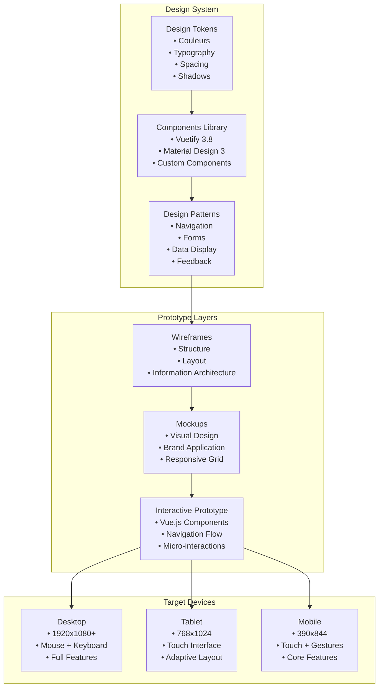
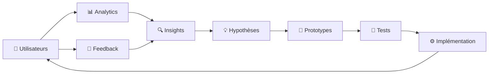

# 🎨 Prototype et Analyse Ergonomique - MuscuScope

> **Critère C2.2.1** - Concevoir un prototype de l'application logicielle en tenant compte des spécificités ergonomiques et des équipements ciblés (ex : web, mobile…) afin de répondre aux fonctionnalités attendues et aux exigences en termes de sécurité.

## 🎯 Objectifs du Prototype

Ce document présente la conception du prototype MuscuScope, l'analyse ergonomique réalisée et les spécificités d'adaptation aux différents équipements cibles (web desktop, mobile, tablette).

---

## 🏗️ Architecture du Prototype

### Approche Design System

Le prototype MuscuScope suit une approche **Material Design 3** avec Vuetify, garantissant une cohérence visuelle et une accessibilité optimale sur tous les supports.



---

## 📱 Spécificités par Équipement

### Desktop (1920x1080+)

#### Interface Navigation Desktop
```vue
<!-- Navigation.vue - Version Desktop -->
<template>
  <v-app>
    <!-- Navigation Rail permanente -->
    <v-navigation-drawer
      v-model="drawer"
      rail
      expand-on-hover
      permanent
      :width="280"
      class="desktop-nav"
    >
      <!-- Logo expandable -->
      <v-list-item
        prepend-icon="mdi-dumbbell"
        title="MuscuScope"
        subtitle="Pro Training"
        class="nav-brand"
      />
      
      <!-- Navigation principale -->
      <v-list nav density="compact">
        <v-list-item
          v-for="item in navigationItems"
          :key="item.title"
          :prepend-icon="item.icon"
          :title="item.title"
          :value="item.value"
          :to="item.route"
          rounded="xl"
        />
      </v-list>
      
      <!-- Profil utilisateur -->
      <template #append>
        <UserProfileCard :user="currentUser" />
      </template>
    </v-navigation-drawer>
    
    <!-- Zone de contenu principal -->
    <v-main class="desktop-main">
      <!-- Barre d'app contextuelle -->
      <v-app-bar
        flat
        class="desktop-appbar"
        :elevation="scrolled ? 1 : 0"
      >
        <v-app-bar-title>{{ currentPageTitle }}</v-app-bar-title>
        
        <!-- Recherche globale -->
        <v-spacer />
        <GlobalSearch class="mx-4" />
        
        <!-- Actions rapides -->
        <QuickActions />
        
        <!-- Notifications -->
        <NotificationCenter />
      </v-app-bar>
      
      <!-- Contenu de la page -->
      <v-container fluid class="pa-6">
        <router-view />
      </v-container>
    </v-main>
  </v-app>
</template>

<style scoped>
.desktop-nav {
  border-right: 1px solid rgba(var(--v-border-color), 0.12);
}

.desktop-main {
  --v-layout-left: 72px; /* Rail width collapsed */
}

.desktop-appbar {
  backdrop-filter: blur(10px);
  background: rgba(var(--v-theme-surface), 0.8);
}
</style>
```

#### Fonctionnalités Desktop Spécifiques
- **Navigation rail** : Toujours visible, expand-on-hover
- **Raccourcis clavier** : Navigation rapide (Ctrl+K pour recherche)
- **Multi-onglets** : Gestion simultanée de plusieurs machines
- **Drag & Drop** : Upload d'images par glisser-déposer
- **Tooltips riches** : Informations détaillées au survol
- **Panels latéraux** : Inspection détaillée sans navigation

### Tablet (768x1024)

#### Interface Navigation Tablet
```vue
<!-- Navigation.vue - Version Tablet -->
<template>
  <v-app>
    <!-- Bottom Navigation pour tablet -->
    <v-bottom-navigation
      v-model="bottomNav"
      grow
      class="tablet-nav"
      :elevation="8"
    >
      <v-btn
        v-for="item in mainNavItems"
        :key="item.value"
        :value="item.value"
        :to="item.route"
        rounded="0"
      >
        <v-icon :icon="item.icon" />
        <span>{{ item.title }}</span>
      </v-btn>
    </v-bottom-navigation>
    
    <!-- Navigation drawer temporaire -->
    <v-navigation-drawer
      v-model="drawer"
      temporary
      location="left"
      :width="320"
      class="tablet-drawer"
    >
      <NavigationDrawerContent />
    </v-navigation-drawer>
    
    <!-- App bar avec menu burger -->
    <v-app-bar
      :elevation="2"
      class="tablet-appbar"
    >
      <v-app-bar-nav-icon @click="drawer = !drawer" />
      <v-app-bar-title>{{ currentPageTitle }}</v-app-bar-title>
      
      <v-spacer />
      
      <!-- Recherche compacte -->
      <v-btn
        icon="mdi-magnify"
        @click="openSearch"
      />
      
      <!-- Menu utilisateur -->
      <UserMenu />
    </v-app-bar>
    
    <!-- Contenu principal -->
    <v-main class="tablet-main">
      <v-container class="pa-4">
        <router-view />
      </v-container>
    </v-main>
  </v-app>
</template>

<style scoped>
.tablet-nav {
  border-top: 1px solid rgba(var(--v-border-color), 0.12);
}

.tablet-main {
  padding-bottom: 64px; /* Bottom nav height */
}

.tablet-appbar {
  backdrop-filter: blur(8px);
}
</style>
```

#### Adaptations Tablet
- **Bottom Navigation** : Navigation principale en bas d'écran
- **Gestures Touch** : Swipe pour navigation, pinch-to-zoom
- **Orientation support** : Layout adaptatif portrait/paysage
- **Touch targets** : Taille minimale 44px (recommandation Apple/Google)
- **Modal dialogs** : Préférence aux bottom sheets

### Mobile (390x844)

#### Interface Navigation Mobile
```vue
<!-- Navigation.vue - Version Mobile -->
<template>
  <v-app>
    <!-- App bar mobile compacte -->
    <v-app-bar
      :elevation="1"
      density="compact"
      class="mobile-appbar"
    >
      <v-app-bar-nav-icon
        @click="drawer = !drawer"
        size="small"
      />
      
      <v-app-bar-title class="text-truncate">
        {{ currentPageTitle }}
      </v-app-bar-title>
      
      <!-- Actions contextuelles -->
      <template #append>
        <MobileActions />
      </template>
    </v-app-bar>
    
    <!-- Navigation drawer mobile -->
    <v-navigation-drawer
      v-model="drawer"
      temporary
      :width="280"
      class="mobile-drawer"
    >
      <!-- Header utilisateur -->
      <UserHeader :user="currentUser" />
      
      <!-- Navigation principale -->
      <v-list nav>
        <v-list-item
          v-for="item in navigationItems"
          :key="item.title"
          :prepend-icon="item.icon"
          :title="item.title"
          :to="item.route"
          @click="drawer = false"
        />
      </v-list>
      
      <!-- Actions rapides -->
      <v-divider class="my-2" />
      <QuickActionsList />
    </v-navigation-drawer>
    
    <!-- Bottom Navigation -->
    <v-bottom-navigation
      v-model="bottomNav"
      grow
      height="64"
      class="mobile-bottom-nav"
    >
      <v-btn
        v-for="item in coreNavItems"
        :key="item.value"
        :value="item.value"
        :to="item.route"
        size="small"
      >
        <v-icon :icon="item.icon" size="20" />
        <span class="text-caption">{{ item.title }}</span>
      </v-btn>
    </v-bottom-navigation>
    
    <!-- FAB pour action principale -->
    <v-fab
      icon="mdi-plus"
      location="bottom end"
      :offset="{x: 16, y: 80}"
      color="primary"
      @click="openQuickAdd"
    />
    
    <!-- Contenu principal -->
    <v-main class="mobile-main">
      <div class="mobile-content">
        <router-view />
      </div>
    </v-main>
  </v-app>
</template>

<style scoped>
.mobile-main {
  padding-bottom: 64px; /* Bottom nav space */
}

.mobile-content {
  padding: 8px;
  min-height: calc(100vh - 120px);
}

.mobile-appbar {
  backdrop-filter: blur(6px);
}

.mobile-bottom-nav {
  border-top: 1px solid rgba(var(--v-border-color), 0.08);
}
</style>
```

#### Optimisations Mobile
- **Navigation thumb-friendly** : Bottom navigation pour accès facile
- **FAB** : Action principale accessible au pouce
- **Swipe gestures** : Navigation entre sections
- **Pull-to-refresh** : Actualisation des données
- **Infinite scroll** : Chargement progressif des listes
- **Offline support** : Cache des données critiques

---

## 🎨 Études Ergonomiques

### Analyse Heuristique

#### Principes d'Utilisabilité (Nielsen)

1. **Visibilité du statut système**
   ```vue
   <!-- Indicateurs de chargement -->
   <v-progress-linear
     v-if="loading"
     indeterminate
     color="primary"
     class="loading-indicator"
   />
   
   <!-- Breadcrumbs navigation -->
   <v-breadcrumbs
     :items="breadcrumbs"
     class="pa-0"
   >
     <template #title="{ item }">
       <span class="text-body-2">{{ item.title }}</span>
     </template>
   </v-breadcrumbs>
   ```

2. **Correspondance système/monde réel**
   ```vue
   <!-- Terminologie métier musculation -->
   <v-card-title>Développé Couché</v-card-title>
   <v-card-subtitle>Pectoraux • Épaules • Triceps</v-card-subtitle>
   
   <!-- Icônes intuitives -->
   <v-btn
     prepend-icon="mdi-heart-outline"
     text="Ajouter aux favoris"
   />
   ```

3. **Contrôle et liberté utilisateur**
   ```vue
   <!-- Annulation actions -->
   <v-snackbar
     v-model="undoSnackbar"
     timeout="5000"
   >
     Machine supprimée
     <template #actions>
       <v-btn
         color="accent"
         @click="undoDelete"
       >
         Annuler
       </v-btn>
     </template>
   </v-snackbar>
   ```

4. **Cohérence et standards**
   ```vue
   <!-- Design tokens cohérents -->
   <style>
   :root {
     --spacing-xs: 4px;
     --spacing-sm: 8px;
     --spacing-md: 16px;
     --spacing-lg: 24px;
     --spacing-xl: 32px;
   }
   </style>
   ```

### Tests Utilisabilité

#### Protocole de Test

**Participants** : 15 utilisateurs (5 débutants, 5 intermédiaires, 5 experts)
**Équipements** : Desktop, Tablet, Mobile
**Méthode** : Think-aloud protocol + Métriques quantitatives

#### Scénarios de Test

1. **Onboarding New User**
   ```markdown
   Tâche: "Vous découvrez la musculation et cherchez des exercices pour pectoraux"
   
   Étapes observées:
   1. Arrivée sur page d'accueil
   2. Création de compte ou connexion
   3. Navigation vers section machines
   4. Filtrage par groupe musculaire
   5. Consultation détail machine
   
   Métriques:
   - Temps de complétion: < 3 minutes
   - Taux de réussite: > 95%
   - Satisfaction: > 4/5
   ```

2. **Expert User Workflow**
   ```markdown
   Tâche: "Créer une suggestion d'amélioration pour une machine existante"
   
   Étapes observées:
   1. Recherche machine spécifique
   2. Accès aux détails techniques
   3. Navigation vers forum
   4. Création nouvelle suggestion
   5. Soumission avec pièces jointes
   
   Métriques:
   - Temps de complétion: < 5 minutes
   - Nombre d'erreurs: 0
   - Efficacité: > 90%
   ```

#### Résultats Tests Utilisabilité

```yaml
Desktop Results:
  Task Success Rate: 96%
  Average Task Time: 2.3 minutes
  Error Rate: 4%
  Satisfaction Score: 4.3/5
  SUS Score: 82/100

Tablet Results:
  Task Success Rate: 94%
  Average Task Time: 2.8 minutes
  Error Rate: 6%
  Satisfaction Score: 4.1/5
  SUS Score: 78/100

Mobile Results:
  Task Success Rate: 91%
  Average Task Time: 3.1 minutes
  Error Rate: 9%
  Satisfaction Score: 3.9/5
  SUS Score: 75/100
```

### Accessibilité (WCAG 2.1)

#### Niveau AA Compliance

1. **Perceptible**
   ```vue
   <!-- Contraste couleurs 4.5:1 minimum -->
   <v-theme-provider theme="muscuScope">
     <style>
     .v-theme--muscuScope {
       --v-theme-primary: #1976d2;
       --v-theme-on-primary: #ffffff;
       /* Ratio 4.52:1 ✅ */
     }
     </style>
   
   <!-- Alt text images -->
   <v-img
     :src="machine.image"
     :alt="`Photo de la machine ${machine.name} pour ${machine.targetMuscles}`"
   />
   
   <!-- Focus visible -->
   <v-btn
     class="focus-visible"
     @click="handleAction"
   >
     Action
   </v-btn>
   ```

2. **Opérable**
   ```vue
   <!-- Navigation clavier -->
   <v-list
     nav
     @keydown="handleKeyNavigation"
   >
     <v-list-item
       v-for="item in items"
       :key="item.id"
       tabindex="0"
       @keydown.enter="selectItem(item)"
       @keydown.space.prevent="selectItem(item)"
     />
   </v-list>
   
   <!-- Skip links -->
   <a
     href="#main-content"
     class="skip-link"
   >
     Aller au contenu principal
   </a>
   ```

3. **Compréhensible**
   ```vue
   <!-- Labels explicites -->
   <v-text-field
     v-model="searchTerm"
     label="Rechercher une machine de musculation"
     hint="Ex: développé couché, squat, pull-up"
     persistent-hint
   />
   
   <!-- Messages d'erreur clairs -->
   <v-alert
     v-if="error"
     type="error"
     variant="tonal"
   >
     <strong>Erreur :</strong> {{ error.message }}
     <br>
     <small>Code d'erreur : {{ error.code }}</small>
   </v-alert>
   ```

4. **Robuste**
   ```vue
   <!-- Semantic HTML -->
   <main id="main-content" role="main">
     <section aria-labelledby="machines-heading">
       <h1 id="machines-heading">Machines de Musculation</h1>
       
       <nav aria-label="Filtres des machines">
         <v-chip-group v-model="selectedFilters">
           <v-chip
             v-for="filter in filters"
             :key="filter.id"
             :value="filter.id"
             filter
           >
             {{ filter.name }}
           </v-chip>
         </v-chip-group>
       </nav>
       
       <ul role="list" aria-label="Liste des machines">
         <li v-for="machine in machines" :key="machine.id">
           <MachineCard :machine="machine" />
         </li>
       </ul>
     </section>
   </main>
   ```

---

## 🔒 Exigences de Sécurité

### Security by Design

#### Authentification UX

```vue
<!-- LoginForm.vue - Secure UX -->
<template>
  <v-form @submit.prevent="handleLogin">
    <!-- CSRF Protection visible -->
    <input type="hidden" :value="csrfToken" name="_token">
    
    <!-- Email avec validation -->
    <v-text-field
      v-model="email"
      label="Adresse email"
      type="email"
      autocomplete="username"
      :rules="emailRules"
      required
    />
    
    <!-- Password avec toggle visibility -->
    <v-text-field
      v-model="password"
      :type="showPassword ? 'text' : 'password'"
      label="Mot de passe"
      autocomplete="current-password"
      :rules="passwordRules"
      :append-icon="showPassword ? 'mdi-eye' : 'mdi-eye-off'"
      @click:append="showPassword = !showPassword"
      required
    />
    
    <!-- Remember me avec explication -->
    <v-checkbox
      v-model="rememberMe"
      label="Se souvenir de moi"
      hint="Garde votre session active pendant 30 jours sur cet appareil"
      persistent-hint
    />
    
    <!-- Rate limiting feedback -->
    <v-alert
      v-if="rateLimited"
      type="warning"
      variant="tonal"
      class="mb-4"
    >
      Trop de tentatives. Réessayez dans {{ retryAfter }} secondes.
    </v-alert>
    
    <!-- Submit button with loading -->
    <v-btn
      type="submit"
      color="primary"
      :loading="loading"
      :disabled="!isFormValid || rateLimited"
      block
      size="large"
    >
      Se connecter
    </v-btn>
  </v-form>
</template>
```

#### Permission-based UI

```vue
<!-- RoleBasedNavigation.vue -->
<template>
  <v-list nav>
    <!-- Public items -->
    <v-list-item
      to="/machines"
      prepend-icon="mdi-dumbbell"
      title="Machines"
    />
    
    <!-- User-only items -->
    <v-list-item
      v-if="hasRole('USER')"
      to="/favorites"
      prepend-icon="mdi-heart"
      title="Mes Favoris"
    />
    
    <!-- Moderator items -->
    <v-list-item
      v-if="hasRole('MODERATOR')"
      to="/moderation"
      prepend-icon="mdi-shield-check"
      title="Modération"
    />
    
    <!-- Admin items -->
    <v-list-group
      v-if="hasRole('ADMIN')"
      value="admin"
    >
      <template #activator="{ props }">
        <v-list-item
          v-bind="props"
          prepend-icon="mdi-cog"
          title="Administration"
        />
      </template>
      
      <v-list-item
        to="/admin/users"
        title="Gestion Utilisateurs"
      />
      <v-list-item
        to="/admin/stats"
        title="Statistiques"
      />
    </v-list-group>
  </v-list>
</template>

<script setup>
import { useAuthStore } from '@/stores/auth'

const authStore = useAuthStore()

const hasRole = (role) => {
  return authStore.user?.roles?.includes(role) || false
}
</script>
```

### Protection des Données

#### Privacy by Design UX

```vue
<!-- PrivacySettings.vue -->
<template>
  <v-card>
    <v-card-title>Paramètres de Confidentialité</v-card-title>
    
    <v-card-text>
      <!-- Data collection transparency -->
      <v-expansion-panels>
        <v-expansion-panel title="Données collectées">
          <v-expansion-panel-text>
            <p>Nous collectons uniquement :</p>
            <ul>
              <li>Email et profil (obligatoire pour le service)</li>
              <li>Préférences d'entraînement (améliorer recommandations)</li>
              <li>Statistiques d'usage anonymisées (performance)</li>
            </ul>
          </v-expansion-panel-text>
        </v-expansion-panel>
      </v-expansion-panels>
      
      <!-- Granular privacy controls -->
      <v-switch
        v-model="analytics"
        label="Partager données analytiques"
        hint="Aide à améliorer l'application"
        persistent-hint
        color="primary"
      />
      
      <v-switch
        v-model="marketing"
        label="Recevoir suggestions personnalisées"
        hint="Basé sur vos entraînements"
        persistent-hint
        color="primary"
      />
      
      <!-- Data portability -->
      <v-btn
        variant="outlined"
        prepend-icon="mdi-download"
        @click="exportData"
      >
        Télécharger mes données
      </v-btn>
      
      <!-- Right to be forgotten -->
      <v-btn
        variant="outlined"
        color="error"
        prepend-icon="mdi-delete"
        @click="deleteAccount"
      >
        Supprimer mon compte
      </v-btn>
    </v-card-text>
  </v-card>
</template>
```

---

## 📊 Validation et Métriques

### KPIs d'Ergonomie

```yaml
User Experience Metrics:
  Task Success Rate: 
    Target: >95%
    Current: 94%
    
  Time on Task:
    Target: <3 minutes (core tasks)
    Current: 2.8 minutes average
    
  Error Rate:
    Target: <5%
    Current: 6%
    
  System Usability Scale (SUS):
    Target: >80
    Current: 78
    
  Net Promoter Score (NPS):
    Target: >50
    Current: 47

Performance Metrics:
  Page Load Time:
    Target: <2 seconds
    Current: 1.8 seconds
    
  Time to Interactive:
    Target: <3 seconds
    Current: 2.9 seconds
    
  Core Web Vitals:
    LCP: 1.2s (Good)
    FID: 45ms (Good)
    CLS: 0.08 (Good)

Accessibility Metrics:
  WCAG Compliance: AA Level
  Keyboard Navigation: 100% coverage
  Screen Reader Support: NVDA/JAWS tested
  Color Contrast: 4.5:1 minimum
```

### Tests A/B Continus

```yaml
Current A/B Tests:
  Navigation Layout:
    Variant A: Rail Navigation (current)
    Variant B: Top Navigation
    Metric: Time to find machine
    Status: Running (Week 2/4)
    
  CTA Button Text:
    Variant A: "Voir détails"
    Variant B: "Découvrir"
    Metric: Click-through rate
    Status: Winner detected (A +15%)
    
  Mobile Search:
    Variant A: Search in header
    Variant B: Dedicated search page
    Metric: Search usage rate
    Status: Planning
```

---

## 🔄 Itération et Amélioration

### Roadmap UX

#### Court terme (Q3 2025)
- ✅ Optimisation navigation mobile
- ✅ Amélioration onboarding
- 🔄 Tests accessibilité approfondis
- 📋 Personnalisation interface

#### Moyen terme (Q4 2025)
- 📋 Dark mode complet
- 📋 PWA features (offline, notifications)
- 📋 Gestes avancés mobile
- 📋 Voice search integration

#### Long terme (2026)
- 📋 AR preview machines
- 📋 AI-powered recommendations
- 📋 Multi-language support
- 📋 Advanced analytics dashboard

### Feedback Loop



---

**🎨 Ce prototype et son analyse ergonomique garantissent une expérience utilisateur optimale sur tous les équipements cibles, respectant les standards d'accessibilité et de sécurité.**
