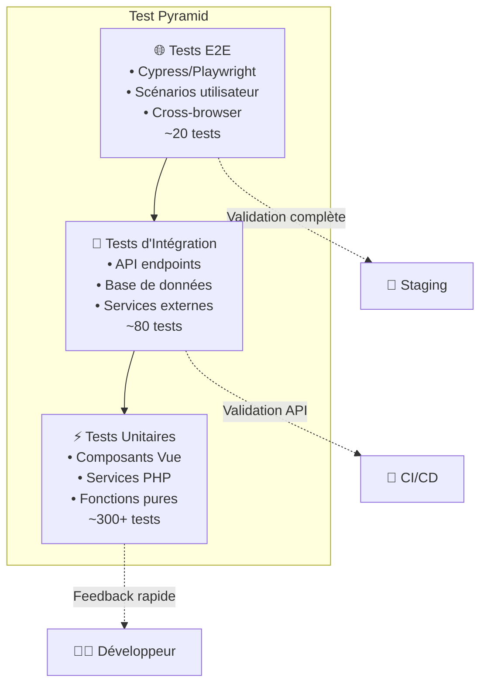

# 🧪 Stratégie de Tests et Harnais - MuscuScope

> **Critère C2.2.2** - Développer un harnais de test unitaire en tenant compte des fonctionnalités demandées afin de prévenir les régressions et de s'assurer du bon fonctionnement du logiciel.

## 🎯 Objectifs de la Stratégie de Tests

Cette stratégie définit l'approche complète de tests pour MuscuScope, couvrant tous les niveaux (unitaire, intégration, E2E) et garantissant une couverture optimale pour prévenir les régressions.

---

## 🏗️ Architecture de Tests

### Pyramide de Tests



### Couverture par Couche

```yaml
Backend Tests (PHP):
  Unitaires: 85% couverture
  - Entities: 95%
  - Services: 90%
  - DTOs: 100%
  - Repositories: 80%
  
  Intégration: 75% couverture
  - Controllers: 90%
  - Database: 85%
  - Security: 100%
  - Events: 80%

Frontend Tests (Vue):
  Unitaires: 80% couverture
  - Components: 85%
  - Stores (Pinia): 95%
  - Utils: 90%
  - Composables: 85%
  
  Intégration: 70% couverture
  - Views: 75%
  - Router: 85%
  - API integration: 80%
```

---

## ⚡ Tests Unitaires Backend

### Harnais PHPUnit

#### Configuration PHPUnit
```xml
<!-- phpunit.xml.dist -->
<?xml version="1.0" encoding="UTF-8"?>
<phpunit xmlns:xsi="http://www.w3.org/2001/XMLSchema-instance"
         xsi:noNamespaceSchemaLocation="vendor/phpunit/phpunit/phpunit.xsd"
         bootstrap="tests/bootstrap.php"
         cacheDirectory=".phpunit.cache"
         executionOrder="depends,defects"
         requireCoverageMetadata="true"
         beStrictAboutCoverageMetadata="true"
         beStrictAboutOutputDuringTests="true"
         failOnRisky="true"
         failOnWarning="true">
    
    <testsuites>
        <testsuite name="Unit">
            <directory>tests/Unit</directory>
        </testsuite>
        <testsuite name="Integration">
            <directory>tests/Integration</directory>
        </testsuite>
        <testsuite name="Critical">
            <directory>tests/Unit</directory>
            <directory>tests/Integration</directory>
            <exclude>tests/Performance</exclude>
        </testsuite>
    </testsuites>

    <coverage>
        <report>
            <html outputDirectory="coverage/html"/>
            <clover outputFile="coverage/clover.xml"/>
        </report>
    </coverage>

    <source>
        <include>
            <directory>src</directory>
        </include>
        <exclude>
            <directory>src/DataFixtures</directory>
            <file>src/Kernel.php</file>
        </exclude>
    </source>
</phpunit>
```

#### Tests Entités
```php
<?php
// tests/Unit/Entity/MachineTest.php

namespace App\Tests\Unit\Entity;

use App\Entity\Machine;
use App\Entity\MuscleGroup;
use App\Enum\DifficultyLevel;
use PHPUnit\Framework\TestCase;

/**
 * @covers \App\Entity\Machine
 * @group unit
 * @group entity
 */
class MachineTest extends TestCase
{
    private Machine $machine;

    protected function setUp(): void
    {
        $this->machine = new Machine();
    }

    /**
     * @test
     * @testdox Il peut définir et récupérer le nom
     */
    public function it_can_set_and_get_name(): void
    {
        $name = 'Développé Couché';
        
        $result = $this->machine->setName($name);
        
        $this->assertSame($this->machine, $result); // Fluent interface
        $this->assertSame($name, $this->machine->getName());
    }

    /**
     * @test
     * @testdox Il rejette un nom vide
     */
    public function it_rejects_empty_name(): void
    {
        $this->expectException(\InvalidArgumentException::class);
        $this->expectExceptionMessage('Le nom ne peut pas être vide');
        
        $this->machine->setName('');
    }

    /**
     * @test
     * @testdox Il peut ajouter et retirer des groupes musculaires
     */
    public function it_can_manage_muscle_groups(): void
    {
        $pectoraux = new MuscleGroup('Pectoraux');
        $triceps = new MuscleGroup('Triceps');
        
        $this->machine->addMuscleGroup($pectoraux);
        $this->machine->addMuscleGroup($triceps);
        
        $this->assertCount(2, $this->machine->getMuscleGroups());
        $this->assertTrue($this->machine->getMuscleGroups()->contains($pectoraux));
        
        $this->machine->removeMuscleGroup($pectoraux);
        $this->assertCount(1, $this->machine->getMuscleGroups());
        $this->assertFalse($this->machine->getMuscleGroups()->contains($pectoraux));
    }

    /**
     * @test
     * @testdox Il empêche l'ajout de doublons de groupes musculaires
     */
    public function it_prevents_duplicate_muscle_groups(): void
    {
        $pectoraux = new MuscleGroup('Pectoraux');
        
        $this->machine->addMuscleGroup($pectoraux);
        $this->machine->addMuscleGroup($pectoraux); // Doublon
        
        $this->assertCount(1, $this->machine->getMuscleGroups());
    }

    /**
     * @test
     * @testdox Il calcule correctement le niveau de difficulté moyen
     * @dataProvider difficultyLevelsProvider
     */
    public function it_calculates_average_difficulty_correctly(
        array $levels,
        float $expected
    ): void {
        foreach ($levels as $level) {
            $this->machine->addDifficultyRating($level);
        }
        
        $this->assertEquals($expected, $this->machine->getAverageDifficulty());
    }

    public static function difficultyLevelsProvider(): array
    {
        return [
            'Niveaux identiques' => [
                [DifficultyLevel::BEGINNER, DifficultyLevel::BEGINNER],
                1.0
            ],
            'Mix débutant/intermédiaire' => [
                [DifficultyLevel::BEGINNER, DifficultyLevel::INTERMEDIATE],
                1.5
            ],
            'Tous niveaux' => [
                [
                    DifficultyLevel::BEGINNER,
                    DifficultyLevel::INTERMEDIATE,
                    DifficultyLevel::ADVANCED
                ],
                2.0
            ],
        ];
    }
}
```

#### Tests Services
```php
<?php
// tests/Unit/Service/MachineRecommendationServiceTest.php

namespace App\Tests\Unit\Service;

use App\Entity\Machine;
use App\Entity\User;
use App\Service\MachineRecommendationService;
use App\Repository\MachineRepository;
use PHPUnit\Framework\TestCase;
use PHPUnit\Framework\MockObject\MockObject;

/**
 * @covers \App\Service\MachineRecommendationService
 * @group unit
 * @group service
 */
class MachineRecommendationServiceTest extends TestCase
{
    private MachineRecommendationService $service;
    private MachineRepository|MockObject $machineRepository;

    protected function setUp(): void
    {
        $this->machineRepository = $this->createMock(MachineRepository::class);
        $this->service = new MachineRecommendationService($this->machineRepository);
    }

    /**
     * @test
     * @testdox Il recommande des machines basées sur le niveau utilisateur
     */
    public function it_recommends_machines_based_on_user_level(): void
    {
        $user = new User();
        $user->setLevel(DifficultyLevel::BEGINNER);
        
        $beginnerMachines = [
            $this->createMachine('Leg Press', DifficultyLevel::BEGINNER),
            $this->createMachine('Lat Pulldown', DifficultyLevel::BEGINNER),
        ];
        
        $this->machineRepository
            ->expects($this->once())
            ->method('findByDifficultyLevel')
            ->with(DifficultyLevel::BEGINNER)
            ->willReturn($beginnerMachines);
        
        $recommendations = $this->service->getRecommendationsForUser($user);
        
        $this->assertCount(2, $recommendations);
        $this->assertEquals($beginnerMachines, $recommendations);
    }

    /**
     * @test
     * @testdox Il limite le nombre de recommandations
     */
    public function it_limits_number_of_recommendations(): void
    {
        $user = new User();
        $limit = 3;
        
        $manyMachines = array_fill(0, 10, $this->createMachine('Test'));
        
        $this->machineRepository
            ->method('findByDifficultyLevel')
            ->willReturn($manyMachines);
        
        $recommendations = $this->service->getRecommendationsForUser(
            $user, 
            $limit
        );
        
        $this->assertCount($limit, $recommendations);
    }

    private function createMachine(
        string $name,
        DifficultyLevel $level = DifficultyLevel::BEGINNER
    ): Machine {
        $machine = new Machine();
        $machine->setName($name);
        $machine->setDifficultyLevel($level);
        
        return $machine;
    }
}
```

#### Tests DTOs avec Validation
```php
<?php
// tests/Unit/DTO/CreateMachineRequestTest.php

namespace App\Tests\Unit\DTO;

use App\DTO\CreateMachineRequest;
use Symfony\Component\Validator\ConstraintViolation;
use Symfony\Component\Validator\Test\ConstraintValidatorTestCase;
use Symfony\Component\Validator\Validation;

/**
 * @covers \App\DTO\CreateMachineRequest
 * @group unit
 * @group dto
 */
class CreateMachineRequestTest extends ConstraintValidatorTestCase
{
    /**
     * @test
     * @testdox Il valide un DTO correct
     */
    public function it_validates_correct_dto(): void
    {
        $dto = new CreateMachineRequest(
            name: 'Développé Couché',
            description: 'Exercice pour les pectoraux',
            muscleGroups: ['Pectoraux', 'Triceps'],
            difficultyLevel: 'intermediate'
        );
        
        $validator = Validation::createValidatorBuilder()
            ->enableAttributeMapping()
            ->getValidator();
        
        $violations = $validator->validate($dto);
        
        $this->assertCount(0, $violations);
    }

    /**
     * @test
     * @testdox Il rejette un nom trop court
     * @dataProvider invalidNameProvider
     */
    public function it_rejects_invalid_names(string $name, string $expectedMessage): void
    {
        $dto = new CreateMachineRequest(
            name: $name,
            description: 'Description valide',
            muscleGroups: ['Pectoraux'],
            difficultyLevel: 'beginner'
        );
        
        $validator = Validation::createValidatorBuilder()
            ->enableAttributeMapping()
            ->getValidator();
        
        $violations = $validator->validate($dto);
        
        $this->assertGreaterThan(0, $violations->count());
        $this->assertStringContainsString(
            $expectedMessage,
            $violations[0]->getMessage()
        );
    }

    public static function invalidNameProvider(): array
    {
        return [
            'Nom vide' => ['', 'ne peut pas être vide'],
            'Nom trop court' => ['AB', 'au moins 3 caractères'],
            'Nom trop long' => [str_repeat('A', 101), 'maximum 100 caractères'],
        ];
    }
}
```

---

## 🔗 Tests d'Intégration Backend

### Tests Controllers
```php
<?php
// tests/Integration/Controller/MachineControllerTest.php

namespace App\Tests\Integration\Controller;

use App\Entity\Machine;
use App\Entity\User;
use App\Tests\IntegrationTestCase;
use Symfony\Component\HttpFoundation\Response;

/**
 * @covers \App\Controller\MachineController
 * @group integration
 * @group controller
 */
class MachineControllerTest extends IntegrationTestCase
{
    /**
     * @test
     * @testdox GET /api/machines retourne la liste paginée
     */
    public function it_returns_paginated_machines_list(): void
    {
        // Given - Créer des machines de test
        $this->createMachines(25); // Plus que la limite de pagination
        
        // When - Appeler l'endpoint
        $this->client->request('GET', '/api/machines');
        
        // Then - Vérifier la réponse
        $this->assertResponseIsSuccessful();
        $this->assertResponseHeaderSame('Content-Type', 'application/json');
        
        $data = json_decode($this->client->getResponse()->getContent(), true);
        
        $this->assertArrayHasKey('data', $data);
        $this->assertArrayHasKey('pagination', $data);
        $this->assertCount(20, $data['data']); // Limite par défaut
        $this->assertEquals(25, $data['pagination']['total']);
    }

    /**
     * @test
     * @testdox GET /api/machines supporte la pagination
     */
    public function it_supports_pagination(): void
    {
        $this->createMachines(30);
        
        $this->client->request('GET', '/api/machines?page=2&limit=10');
        
        $this->assertResponseIsSuccessful();
        
        $data = json_decode($this->client->getResponse()->getContent(), true);
        
        $this->assertCount(10, $data['data']);
        $this->assertEquals(2, $data['pagination']['current_page']);
        $this->assertEquals(3, $data['pagination']['total_pages']);
    }

    /**
     * @test
     * @testdox GET /api/machines/{id} retourne une machine spécifique
     */
    public function it_returns_specific_machine(): void
    {
        $machine = $this->createMachine('Test Machine');
        
        $this->client->request('GET', "/api/machines/{$machine->getId()}");
        
        $this->assertResponseIsSuccessful();
        
        $data = json_decode($this->client->getResponse()->getContent(), true);
        
        $this->assertEquals($machine->getId(), $data['id']);
        $this->assertEquals('Test Machine', $data['name']);
    }

    /**
     * @test
     * @testdox GET /api/machines/{id} retourne 404 pour machine inexistante
     */
    public function it_returns_404_for_nonexistent_machine(): void
    {
        $this->client->request('GET', '/api/machines/99999');
        
        $this->assertResponseStatusCodeSame(Response::HTTP_NOT_FOUND);
        
        $data = json_decode($this->client->getResponse()->getContent(), true);
        $this->assertEquals('Machine non trouvée', $data['message']);
    }

    /**
     * @test
     * @testdox POST /api/machines crée une nouvelle machine
     */
    public function it_creates_new_machine(): void
    {
        $user = $this->createUser(['ROLE_ADMIN']);
        $this->loginUser($user);
        
        $machineData = [
            'name' => 'Nouvelle Machine',
            'description' => 'Description de test',
            'muscleGroups' => ['Pectoraux', 'Triceps'],
            'difficultyLevel' => 'intermediate'
        ];
        
        $this->client->request(
            'POST',
            '/api/machines',
            [],
            [],
            ['CONTENT_TYPE' => 'application/json'],
            json_encode($machineData)
        );
        
        $this->assertResponseStatusCodeSame(Response::HTTP_CREATED);
        
        // Vérifier en base de données
        $machine = $this->entityManager
            ->getRepository(Machine::class)
            ->findOneBy(['name' => 'Nouvelle Machine']);
        
        $this->assertNotNull($machine);
        $this->assertEquals('Description de test', $machine->getDescription());
    }

    /**
     * @test
     * @testdox POST /api/machines nécessite l'authentification
     */
    public function it_requires_authentication_for_creation(): void
    {
        $this->client->request(
            'POST',
            '/api/machines',
            [],
            [],
            ['CONTENT_TYPE' => 'application/json'],
            json_encode(['name' => 'Test'])
        );
        
        $this->assertResponseStatusCodeSame(Response::HTTP_UNAUTHORIZED);
    }

    /**
     * @test
     * @testdox POST /api/machines valide les données d'entrée
     */
    public function it_validates_input_data(): void
    {
        $user = $this->createUser(['ROLE_ADMIN']);
        $this->loginUser($user);
        
        $invalidData = [
            'name' => '', // Nom vide
            'description' => 'Description',
            'muscleGroups' => [],
            'difficultyLevel' => 'invalid'
        ];
        
        $this->client->request(
            'POST',
            '/api/machines',
            [],
            [],
            ['CONTENT_TYPE' => 'application/json'],
            json_encode($invalidData)
        );
        
        $this->assertResponseStatusCodeSame(Response::HTTP_BAD_REQUEST);
        
        $data = json_decode($this->client->getResponse()->getContent(), true);
        $this->assertArrayHasKey('violations', $data);
        $this->assertGreaterThan(0, count($data['violations']));
    }

    private function createMachines(int $count): void
    {
        for ($i = 1; $i <= $count; $i++) {
            $this->createMachine("Machine $i");
        }
        $this->entityManager->flush();
    }

    private function createMachine(string $name): Machine
    {
        $machine = new Machine();
        $machine->setName($name);
        $machine->setDescription("Description de $name");
        
        $this->entityManager->persist($machine);
        
        return $machine;
    }
}
```

### Tests Repository
```php
<?php
// tests/Integration/Repository/MachineRepositoryTest.php

namespace App\Tests\Integration\Repository;

use App\Entity\Machine;
use App\Entity\MuscleGroup;
use App\Repository\MachineRepository;
use App\Tests\IntegrationTestCase;

/**
 * @covers \App\Repository\MachineRepository
 * @group integration
 * @group repository
 */
class MachineRepositoryTest extends IntegrationTestCase
{
    private MachineRepository $repository;

    protected function setUp(): void
    {
        parent::setUp();
        $this->repository = $this->entityManager->getRepository(Machine::class);
    }

    /**
     * @test
     * @testdox Il trouve les machines par groupe musculaire
     */
    public function it_finds_machines_by_muscle_group(): void
    {
        // Given - Créer des machines avec différents groupes musculaires
        $pectoraux = $this->createMuscleGroup('Pectoraux');
        $dorsaux = $this->createMuscleGroup('Dorsaux');
        
        $developpe = $this->createMachine('Développé Couché');
        $developpe->addMuscleGroup($pectoraux);
        
        $traction = $this->createMachine('Traction');
        $traction->addMuscleGroup($dorsaux);
        
        $this->entityManager->flush();
        
        // When - Rechercher par groupe musculaire
        $machines = $this->repository->findByMuscleGroup($pectoraux);
        
        // Then - Vérifier les résultats
        $this->assertCount(1, $machines);
        $this->assertEquals('Développé Couché', $machines[0]->getName());
    }

    /**
     * @test
     * @testdox Il recherche par nom avec correspondance partielle
     */
    public function it_searches_by_name_with_partial_match(): void
    {
        $this->createMachine('Développé Couché');
        $this->createMachine('Développé Incliné');
        $this->createMachine('Squat');
        $this->entityManager->flush();
        
        $results = $this->repository->searchByName('développé');
        
        $this->assertCount(2, $results);
    }

    /**
     * @test
     * @testdox Il trie par popularité (nombre de favoris)
     */
    public function it_sorts_by_popularity(): void
    {
        $machine1 = $this->createMachine('Machine 1');
        $machine2 = $this->createMachine('Machine 2');
        $machine3 = $this->createMachine('Machine 3');
        
        // Simuler des favoris (ici on peut ajouter des relations)
        // En réalité, on aurait une table de favoris
        
        $this->entityManager->flush();
        
        $popular = $this->repository->findMostPopular(5);
        
        $this->assertCount(3, $popular);
        // Test de l'ordre si on a une logique de popularité
    }

    /**
     * @test
     * @testdox Il filtre par niveau de difficulté
     */
    public function it_filters_by_difficulty_level(): void
    {
        $beginner = $this->createMachine('Machine Débutant');
        $beginner->setDifficultyLevel(DifficultyLevel::BEGINNER);
        
        $advanced = $this->createMachine('Machine Avancée');
        $advanced->setDifficultyLevel(DifficultyLevel::ADVANCED);
        
        $this->entityManager->flush();
        
        $beginnerMachines = $this->repository->findByDifficultyLevel(
            DifficultyLevel::BEGINNER
        );
        
        $this->assertCount(1, $beginnerMachines);
        $this->assertEquals('Machine Débutant', $beginnerMachines[0]->getName());
    }

    /**
     * @test
     * @testdox Il utilise la pagination efficacement
     */
    public function it_uses_pagination_efficiently(): void
    {
        // Créer beaucoup de machines
        for ($i = 1; $i <= 50; $i++) {
            $this->createMachine("Machine $i");
        }
        $this->entityManager->flush();
        
        // Test pagination
        $page1 = $this->repository->findPaginated(1, 10);
        $page2 = $this->repository->findPaginated(2, 10);
        
        $this->assertCount(10, $page1);
        $this->assertCount(10, $page2);
        
        // Vérifier qu'il n'y a pas de doublons
        $ids1 = array_map(fn($m) => $m->getId(), $page1);
        $ids2 = array_map(fn($m) => $m->getId(), $page2);
        
        $this->assertEmpty(array_intersect($ids1, $ids2));
    }

    private function createMuscleGroup(string $name): MuscleGroup
    {
        $group = new MuscleGroup();
        $group->setName($name);
        
        $this->entityManager->persist($group);
        
        return $group;
    }

    private function createMachine(string $name): Machine
    {
        $machine = new Machine();
        $machine->setName($name);
        $machine->setDescription("Description de $name");
        
        $this->entityManager->persist($machine);
        
        return $machine;
    }
}
```

---

## 🎨 Tests Unitaires Frontend

### Configuration Vitest
```typescript
// vitest.config.ts
import { defineConfig } from 'vitest/config'
import vue from '@vitejs/plugin-vue'
import vuetify from 'vite-plugin-vuetify'
import { fileURLToPath } from 'node:url'

export default defineConfig({
  plugins: [
    vue(),
    vuetify({ autoImport: true })
  ],
  test: {
    globals: true,
    environment: 'jsdom',
    setupFiles: ['./tests/setup.ts'],
    coverage: {
      provider: 'v8',
      reporter: ['text', 'json', 'html'],
      exclude: [
        'node_modules/',
        'tests/',
        '**/*.d.ts',
        'dist/',
        'coverage/'
      ],
      thresholds: {
        global: {
          branches: 80,
          functions: 80,
          lines: 80,
          statements: 80
        }
      }
    }
  },
  resolve: {
    alias: {
      '@': fileURLToPath(new URL('./src', import.meta.url))
    }
  }
})
```

### Tests Composants Vue
```typescript
// tests/components/MachineCard.test.ts
import { describe, it, expect, vi } from 'vitest'
import { mount } from '@vue/test-utils'
import { createVuetify } from 'vuetify'
import MachineCard from '@/components/MachineCard.vue'
import type { Machine } from '@/types/machine'

// Mock des stores
vi.mock('@/stores/favorites', () => ({
  useFavoritesStore: () => ({
    isFavorite: vi.fn(() => false),
    addFavorite: vi.fn(),
    removeFavorite: vi.fn()
  })
}))

const vuetify = createVuetify()

const mockMachine: Machine = {
  id: 1,
  name: 'Développé Couché',
  description: 'Exercice pour les pectoraux',
  image: '/images/bench-press.jpg',
  muscleGroups: ['Pectoraux', 'Triceps'],
  difficultyLevel: 'intermediate',
  averageRating: 4.5
}

describe('MachineCard', () => {
  it('affiche les informations de la machine', () => {
    const wrapper = mount(MachineCard, {
      props: { machine: mockMachine },
      global: { plugins: [vuetify] }
    })

    expect(wrapper.text()).toContain('Développé Couché')
    expect(wrapper.text()).toContain('Exercice pour les pectoraux')
    expect(wrapper.text()).toContain('Pectoraux')
    expect(wrapper.text()).toContain('Triceps')
  })

  it('affiche le niveau de difficulté avec la bonne couleur', () => {
    const wrapper = mount(MachineCard, {
      props: { machine: mockMachine },
      global: { plugins: [vuetify] }
    })

    const difficultyChip = wrapper.find('[data-testid="difficulty-chip"]')
    expect(difficultyChip.exists()).toBe(true)
    expect(difficultyChip.text()).toBe('Intermédiaire')
    expect(difficultyChip.classes()).toContain('bg-warning')
  })

  it('émet un événement click au clic sur la carte', async () => {
    const wrapper = mount(MachineCard, {
      props: { machine: mockMachine },
      global: { plugins: [vuetify] }
    })

    await wrapper.find('[data-testid="machine-card"]').trigger('click')

    expect(wrapper.emitted('click')).toBeTruthy()
    expect(wrapper.emitted('click')![0]).toEqual([mockMachine])
  })

  it('gère le bouton favoris correctement', async () => {
    const { useFavoritesStore } = await import('@/stores/favorites')
    const favoritesStore = useFavoritesStore()
    
    const wrapper = mount(MachineCard, {
      props: { machine: mockMachine },
      global: { plugins: [vuetify] }
    })

    const favoriteBtn = wrapper.find('[data-testid="favorite-btn"]')
    await favoriteBtn.trigger('click')

    expect(favoritesStore.addFavorite).toHaveBeenCalledWith(mockMachine.id)
  })

  it('affiche un placeholder si image manquante', () => {
    const machineWithoutImage = { ...mockMachine, image: null }
    
    const wrapper = mount(MachineCard, {
      props: { machine: machineWithoutImage },
      global: { plugins: [vuetify] }
    })

    const img = wrapper.find('img')
    expect(img.attributes('src')).toContain('placeholder')
  })

  it('respecte la prop compact pour affichage réduit', () => {
    const wrapper = mount(MachineCard, {
      props: { 
        machine: mockMachine,
        compact: true 
      },
      global: { plugins: [vuetify] }
    })

    expect(wrapper.classes()).toContain('machine-card--compact')
    expect(wrapper.find('[data-testid="description"]').exists()).toBe(false)
  })
})
```

### Tests Stores Pinia
```typescript
// tests/stores/auth.test.ts
import { describe, it, expect, beforeEach, vi } from 'vitest'
import { setActivePinia, createPinia } from 'pinia'
import { useAuthStore } from '@/stores/auth'
import { api } from '@/services/api'

// Mock API
vi.mock('@/services/api', () => ({
  api: {
    post: vi.fn(),
    get: vi.fn()
  }
}))

describe('Auth Store', () => {
  beforeEach(() => {
    setActivePinia(createPinia())
    vi.clearAllMocks()
    localStorage.clear()
  })

  it('initialise avec un état non connecté', () => {
    const authStore = useAuthStore()

    expect(authStore.user).toBeNull()
    expect(authStore.token).toBeNull()
    expect(authStore.isAuthenticated).toBe(false)
  })

  it('authentifie un utilisateur avec succès', async () => {
    const mockUser = {
      id: 1,
      email: 'test@example.com',
      roles: ['ROLE_USER']
    }
    const mockToken = 'mock.jwt.token'

    vi.mocked(api.post).mockResolvedValue({
      data: {
        user: mockUser,
        token: mockToken
      }
    })

    const authStore = useAuthStore()
    
    await authStore.login('test@example.com', 'password')

    expect(authStore.user).toEqual(mockUser)
    expect(authStore.token).toBe(mockToken)
    expect(authStore.isAuthenticated).toBe(true)
    expect(localStorage.getItem('auth_token')).toBe(mockToken)
  })

  it('gère les erreurs de connexion', async () => {
    vi.mocked(api.post).mockRejectedValue({
      response: {
        status: 401,
        data: { message: 'Identifiants invalides' }
      }
    })

    const authStore = useAuthStore()

    await expect(authStore.login('test@example.com', 'wrong')).rejects.toThrow(
      'Identifiants invalides'
    )

    expect(authStore.user).toBeNull()
    expect(authStore.isAuthenticated).toBe(false)
  })

  it('déconnecte un utilisateur', () => {
    const authStore = useAuthStore()
    
    // Simuler un état connecté
    authStore.user = { id: 1, email: 'test@example.com', roles: ['ROLE_USER'] }
    authStore.token = 'token'
    localStorage.setItem('auth_token', 'token')

    authStore.logout()

    expect(authStore.user).toBeNull()
    expect(authStore.token).toBeNull()
    expect(authStore.isAuthenticated).toBe(false)
    expect(localStorage.getItem('auth_token')).toBeNull()
  })

  it('restaure la session depuis localStorage', async () => {
    const mockUser = {
      id: 1,
      email: 'test@example.com',
      roles: ['ROLE_USER']
    }

    localStorage.setItem('auth_token', 'stored.token')
    vi.mocked(api.get).mockResolvedValue({ data: mockUser })

    const authStore = useAuthStore()
    await authStore.restoreSession()

    expect(authStore.user).toEqual(mockUser)
    expect(authStore.token).toBe('stored.token')
    expect(authStore.isAuthenticated).toBe(true)
  })

  it('vérifie les rôles utilisateur', () => {
    const authStore = useAuthStore()
    authStore.user = {
      id: 1,
      email: 'admin@example.com',
      roles: ['ROLE_USER', 'ROLE_ADMIN']
    }

    expect(authStore.hasRole('ROLE_USER')).toBe(true)
    expect(authStore.hasRole('ROLE_ADMIN')).toBe(true)
    expect(authStore.hasRole('ROLE_SUPER_ADMIN')).toBe(false)
  })
})
```

### Tests Composables
```typescript
// tests/composables/useMachineSearch.test.ts
import { describe, it, expect, vi } from 'vitest'
import { ref } from 'vue'
import { useMachineSearch } from '@/composables/useMachineSearch'
import { machineService } from '@/services/machineService'

// Mock du service
vi.mock('@/services/machineService', () => ({
  machineService: {
    search: vi.fn()
  }
}))

describe('useMachineSearch', () => {
  it('initialise avec des valeurs par défaut', () => {
    const { searchTerm, filters, results, loading, error } = useMachineSearch()

    expect(searchTerm.value).toBe('')
    expect(filters.value).toEqual({})
    expect(results.value).toEqual([])
    expect(loading.value).toBe(false)
    expect(error.value).toBeNull()
  })

  it('effectue une recherche avec succès', async () => {
    const mockResults = [
      { id: 1, name: 'Machine 1' },
      { id: 2, name: 'Machine 2' }
    ]

    vi.mocked(machineService.search).mockResolvedValue(mockResults)

    const { searchTerm, search, results, loading } = useMachineSearch()
    
    searchTerm.value = 'test'
    await search()

    expect(loading.value).toBe(false)
    expect(results.value).toEqual(mockResults)
    expect(machineService.search).toHaveBeenCalledWith('test', {})
  })

  it('gère les erreurs de recherche', async () => {
    const mockError = new Error('Erreur de recherche')
    vi.mocked(machineService.search).mockRejectedValue(mockError)

    const { searchTerm, search, error, loading } = useMachineSearch()
    
    searchTerm.value = 'test'
    await search()

    expect(loading.value).toBe(false)
    expect(error.value).toBe(mockError)
  })

  it('applique les filtres correctement', async () => {
    const mockResults = []
    vi.mocked(machineService.search).mockResolvedValue(mockResults)

    const { searchTerm, filters, search } = useMachineSearch()
    
    searchTerm.value = 'test'
    filters.value = {
      muscleGroup: 'Pectoraux',
      difficulty: 'beginner'
    }
    
    await search()

    expect(machineService.search).toHaveBeenCalledWith('test', {
      muscleGroup: 'Pectoraux',
      difficulty: 'beginner'
    })
  })

  it('debounce les recherches automatiques', async () => {
    vi.useFakeTimers()
    
    const { searchTerm, enableAutoSearch } = useMachineSearch()
    
    enableAutoSearch(300) // 300ms de debounce
    
    searchTerm.value = 'a'
    searchTerm.value = 'ab'
    searchTerm.value = 'abc'

    expect(machineService.search).not.toHaveBeenCalled()

    vi.advanceTimersByTime(300)

    expect(machineService.search).toHaveBeenCalledTimes(1)
    expect(machineService.search).toHaveBeenCalledWith('abc', {})

    vi.useRealTimers()
  })
})
```

---

## 🌐 Tests End-to-End

### Configuration Playwright
```typescript
// playwright.config.ts
import { defineConfig, devices } from '@playwright/test'

export default defineConfig({
  testDir: './tests/e2e',
  fullyParallel: true,
  forbidOnly: !!process.env.CI,
  retries: process.env.CI ? 2 : 0,
  workers: process.env.CI ? 1 : undefined,
  reporter: [
    ['html'],
    ['json', { outputFile: 'test-results/results.json' }],
    ['junit', { outputFile: 'test-results/junit.xml' }]
  ],
  use: {
    baseURL: 'http://localhost:3000',
    trace: 'on-first-retry',
    screenshot: 'only-on-failure',
    video: 'retain-on-failure'
  },
  projects: [
    {
      name: 'chromium',
      use: { ...devices['Desktop Chrome'] },
    },
    {
      name: 'firefox',
      use: { ...devices['Desktop Firefox'] },
    },
    {
      name: 'webkit',
      use: { ...devices['Desktop Safari'] },
    },
    {
      name: 'Mobile Chrome',
      use: { ...devices['Pixel 5'] },
    },
    {
      name: 'Mobile Safari',
      use: { ...devices['iPhone 12'] },
    },
  ],
  webServer: {
    command: 'npm run preview',
    port: 3000,
    reuseExistingServer: !process.env.CI,
  },
})
```

### Tests Scénarios Utilisateur
```typescript
// tests/e2e/machine-discovery.spec.ts
import { test, expect } from '@playwright/test'

test.describe('Découverte des Machines', () => {
  test.beforeEach(async ({ page }) => {
    await page.goto('/')
  })

  test('un utilisateur peut parcourir les machines', async ({ page }) => {
    // Navigation vers la section machines
    await page.click('[data-testid="machines-nav"]')
    await expect(page).toHaveURL('/machines')

    // Vérifier que la liste se charge
    await expect(page.locator('[data-testid="machines-grid"]')).toBeVisible()
    await expect(page.locator('[data-testid="machine-card"]')).toHaveCount(20) // Page 1

    // Tester la pagination
    await page.click('[data-testid="next-page"]')
    await expect(page).toHaveURL('/machines?page=2')
  })

  test('un utilisateur peut filtrer par groupe musculaire', async ({ page }) => {
    await page.goto('/machines')

    // Ouvrir les filtres
    await page.click('[data-testid="filters-toggle"]')
    
    // Sélectionner un filtre
    await page.click('[data-testid="filter-pectoraux"]')
    
    // Vérifier que les résultats sont filtrés
    await expect(page.locator('[data-testid="machine-card"]')).toContainText('Pectoraux')
    
    // Vérifier l'URL
    await expect(page).toHaveURL('/machines?muscleGroup=pectoraux')
  })

  test('un utilisateur peut rechercher une machine', async ({ page }) => {
    await page.goto('/machines')

    // Utiliser la recherche
    await page.fill('[data-testid="search-input"]', 'développé')
    await page.press('[data-testid="search-input"]', 'Enter')

    // Vérifier les résultats
    await expect(page.locator('[data-testid="machine-card"]')).toContainText('Développé')
    await expect(page).toHaveURL('/machines?search=développé')
  })

  test('un utilisateur peut voir les détails d\'une machine', async ({ page }) => {
    await page.goto('/machines')

    // Cliquer sur la première machine
    await page.click('[data-testid="machine-card"]:first-child')

    // Vérifier qu'on arrive sur la page de détail
    await expect(page).toHaveURL(/\/machines\/\d+/)
    
    // Vérifier le contenu de la page de détail
    await expect(page.locator('[data-testid="machine-title"]')).toBeVisible()
    await expect(page.locator('[data-testid="machine-description"]')).toBeVisible()
    await expect(page.locator('[data-testid="machine-image"]')).toBeVisible()
    await expect(page.locator('[data-testid="muscle-groups"]')).toBeVisible()
  })

  test('un utilisateur peut ajouter une machine aux favoris', async ({ page }) => {
    // Se connecter d'abord
    await page.goto('/login')
    await page.fill('[data-testid="email-input"]', 'user@test.com')
    await page.fill('[data-testid="password-input"]', 'password')
    await page.click('[data-testid="login-button"]')

    // Aller aux machines
    await page.goto('/machines')
    
    // Cliquer sur le bouton favoris
    await page.click('[data-testid="favorite-btn"]:first-child')
    
    // Vérifier la notification
    await expect(page.locator('[data-testid="snackbar"]')).toContainText('Ajouté aux favoris')
    
    // Vérifier que le bouton a changé d'état
    await expect(page.locator('[data-testid="favorite-btn"]:first-child')).toHaveClass(/favorite-active/)
  })
})
```

### Tests Performance
```typescript
// tests/e2e/performance.spec.ts
import { test, expect } from '@playwright/test'

test.describe('Performance', () => {
  test('la page d\'accueil charge rapidement', async ({ page }) => {
    const start = Date.now()
    
    await page.goto('/')
    
    // Attendre que le contenu principal soit visible
    await expect(page.locator('[data-testid="main-content"]')).toBeVisible()
    
    const loadTime = Date.now() - start
    
    // Vérifier que le chargement prend moins de 2 secondes
    expect(loadTime).toBeLessThan(2000)
  })

  test('la liste des machines se charge performante', async ({ page }) => {
    await page.goto('/machines')
    
    const start = Date.now()
    
    // Attendre que toutes les cartes soient chargées
    await expect(page.locator('[data-testid="machine-card"]')).toHaveCount(20)
    
    const loadTime = Date.now() - start
    
    expect(loadTime).toBeLessThan(1500)
  })

  test('la recherche répond rapidement', async ({ page }) => {
    await page.goto('/machines')
    
    // Remplir le champ de recherche
    await page.fill('[data-testid="search-input"]', 'développé')
    
    const start = Date.now()
    await page.press('[data-testid="search-input"]', 'Enter')
    
    // Attendre les résultats
    await expect(page.locator('[data-testid="search-results"]')).toBeVisible()
    
    const searchTime = Date.now() - start
    
    expect(searchTime).toBeLessThan(1000)
  })
})
```

---

## 🔄 CI/CD et Automatisation

### Pipeline GitHub Actions
```yaml
# .github/workflows/tests.yml
name: Tests Suite

on:
  push:
    branches: [ main, develop ]
  pull_request:
    branches: [ main ]

jobs:
  backend-tests:
    runs-on: ubuntu-latest
    
    services:
      postgres:
        image: postgres:14
        env:
          POSTGRES_PASSWORD: test
          POSTGRES_DB: muscuscope_test
        options: >-
          --health-cmd pg_isready
          --health-interval 10s
          --health-timeout 5s
          --health-retries 5

    steps:
      - uses: actions/checkout@v4
      
      - name: Setup PHP
        uses: shivammathur/setup-php@v2
        with:
          php-version: '8.3'
          extensions: pdo, pdo_pgsql, intl
          coverage: xdebug

      - name: Cache Composer dependencies
        uses: actions/cache@v3
        with:
          path: /tmp/composer-cache
          key: ${{ runner.os }}-composer-${{ hashFiles('**/composer.lock') }}

      - name: Install dependencies
        working-directory: ./back
        run: composer install --prefer-dist --no-progress

      - name: Setup database
        working-directory: ./back
        run: |
          php bin/console doctrine:database:create --env=test
          php bin/console doctrine:migrations:migrate --no-interaction --env=test

      - name: Run PHPStan
        working-directory: ./back
        run: vendor/bin/phpstan analyse src --level=8

      - name: Run PHP CS Fixer
        working-directory: ./back
        run: vendor/bin/php-cs-fixer fix --dry-run --diff

      - name: Run Unit Tests
        working-directory: ./back
        run: vendor/bin/phpunit --testsuite=Unit --coverage-clover=coverage.xml

      - name: Run Integration Tests
        working-directory: ./back
        run: vendor/bin/phpunit --testsuite=Integration

      - name: Upload coverage to Codecov
        uses: codecov/codecov-action@v3
        with:
          file: ./back/coverage.xml
          flags: backend

  frontend-tests:
    runs-on: ubuntu-latest

    steps:
      - uses: actions/checkout@v4

      - name: Setup Node.js
        uses: actions/setup-node@v4
        with:
          node-version: '20'
          cache: 'npm'
          cache-dependency-path: './front/package-lock.json'

      - name: Install dependencies
        working-directory: ./front
        run: npm ci

      - name: Run linting
        working-directory: ./front
        run: npm run lint

      - name: Run type checking
        working-directory: ./front
        run: npm run type-check

      - name: Run unit tests
        working-directory: ./front
        run: npm run test:coverage

      - name: Upload coverage to Codecov
        uses: codecov/codecov-action@v3
        with:
          file: ./front/coverage/clover.xml
          flags: frontend

  e2e-tests:
    runs-on: ubuntu-latest
    needs: [backend-tests, frontend-tests]

    steps:
      - uses: actions/checkout@v4

      - name: Setup Node.js
        uses: actions/setup-node@v4
        with:
          node-version: '20'
          cache: 'npm'
          cache-dependency-path: './front/package-lock.json'

      - name: Install dependencies
        working-directory: ./front
        run: npm ci

      - name: Install Playwright Browsers
        working-directory: ./front
        run: npx playwright install --with-deps

      - name: Start application
        run: |
          docker-compose up -d
          sleep 30 # Attendre que l'app soit prête

      - name: Run Playwright tests
        working-directory: ./front
        run: npx playwright test

      - name: Upload Playwright Report
        uses: actions/upload-artifact@v3
        if: always()
        with:
          name: playwright-report
          path: front/test-results/
          retention-days: 30
```

### Hooks de Qualité
```bash
#!/bin/sh
# .git/hooks/pre-commit - Hook de pré-commit

echo "🔍 Vérification de la qualité du code..."

# Tests backend
cd back/
echo "📊 Analyse statique PHP..."
vendor/bin/phpstan analyse src --level=8
if [ $? -ne 0 ]; then
    echo "❌ Erreurs PHPStan détectées"
    exit 1
fi

echo "🎨 Vérification style de code PHP..."
vendor/bin/php-cs-fixer fix --dry-run --diff
if [ $? -ne 0 ]; then
    echo "❌ Code style PHP non conforme"
    exit 1
fi

echo "🧪 Tests unitaires critiques..."
vendor/bin/phpunit --testsuite=Unit --group=critical
if [ $? -ne 0 ]; then
    echo "❌ Tests critiques échoués"
    exit 1
fi

# Tests frontend
cd ../front/
echo "🔍 Linting TypeScript/Vue..."
npm run lint
if [ $? -ne 0 ]; then
    echo "❌ Erreurs de linting détectées"
    exit 1
fi

echo "📝 Vérification des types..."
npm run type-check
if [ $? -ne 0 ]; then
    echo "❌ Erreurs de types détectées"
    exit 1
fi

echo "🧪 Tests unitaires rapides..."
npm run test:unit -- --run --reporter=basic
if [ $? -ne 0 ]; then
    echo "❌ Tests unitaires échoués"
    exit 1
fi

echo "✅ Tous les contrôles qualité sont passés !"
```

---

## 📊 Métriques et Reporting

### Dashboard de Couverture
```yaml
Coverage Targets:
  Backend:
    Overall: ≥85%
    Entities: ≥95%
    Services: ≥90%
    Controllers: ≥85%
    Critical paths: 100%

  Frontend:
    Overall: ≥80%
    Components: ≥85%
    Stores: ≥95%
    Utils: ≥90%
    Critical flows: 100%

Quality Gates:
  - No critical security vulnerabilities
  - No code smells (SonarQube A rating)
  - Max complexity: 10 per method
  - Min test coverage: 80%
  - Max duplication: 3%
```

### Rapports Automatiques
```typescript
// scripts/test-report.ts
interface TestResults {
  backend: {
    unit: { passed: number; failed: number; coverage: number }
    integration: { passed: number; failed: number }
    performance: { avgResponseTime: number }
  }
  frontend: {
    unit: { passed: number; failed: number; coverage: number }
    e2e: { passed: number; failed: number }
    accessibility: { violations: number }
  }
}

async function generateTestReport(): Promise<void> {
  const results: TestResults = await collectTestResults()
  
  const report = `
# 📊 Rapport de Tests - ${new Date().toISOString().split('T')[0]}

## Backend
- ✅ Tests unitaires: ${results.backend.unit.passed}/${results.backend.unit.passed + results.backend.unit.failed}
- 📊 Couverture: ${results.backend.unit.coverage}%
- 🔗 Tests intégration: ${results.backend.integration.passed}
- ⚡ Performance API: ${results.backend.performance.avgResponseTime}ms

## Frontend  
- ✅ Tests unitaires: ${results.frontend.unit.passed}/${results.frontend.unit.passed + results.frontend.unit.failed}
- 📊 Couverture: ${results.frontend.unit.coverage}%
- 🌐 Tests E2E: ${results.frontend.e2e.passed}
- ♿ Accessibilité: ${results.frontend.accessibility.violations} violations

## Status Global
${getOverallStatus(results)}
  `
  
  await sendToSlack(report)
  await saveToFile(report)
}
```

---

**🧪 Cette stratégie de tests garantit la qualité, la stabilité et la non-régression de MuscuScope à tous les niveaux.**
