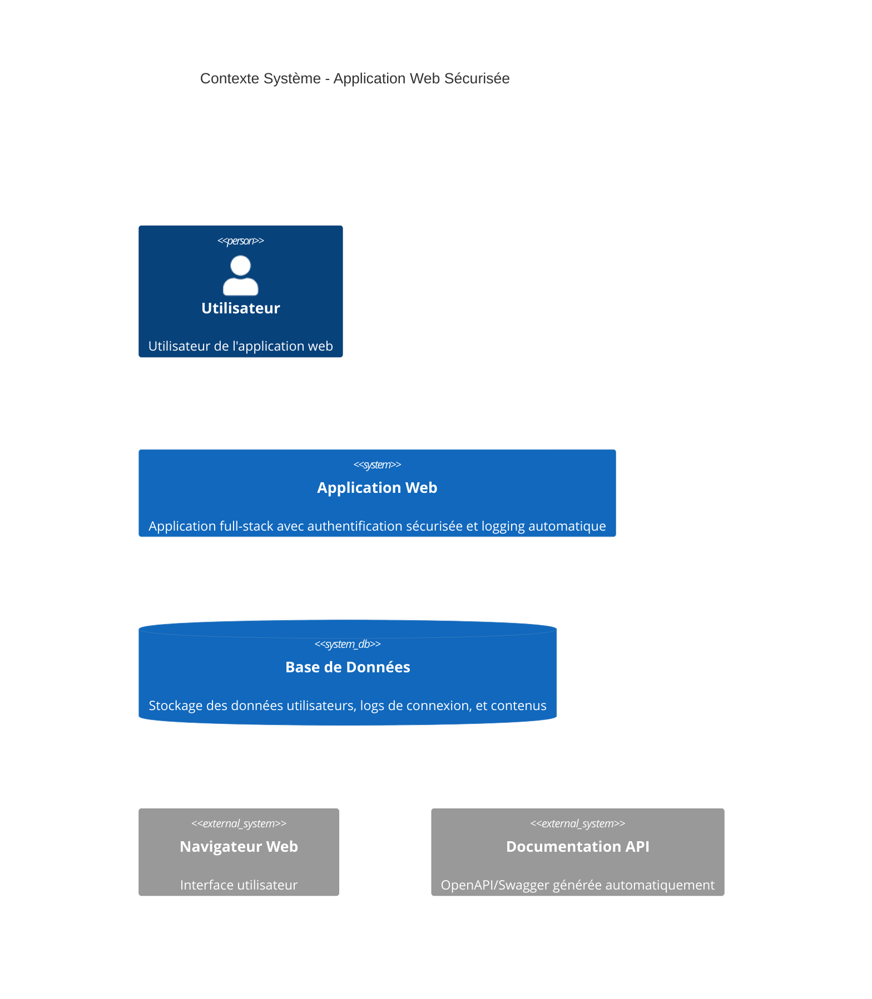

# Schémas C4 - Documentation Architecture

Ce document explique les diagrammes C4 (Context, Containers, Components, Code) utilisés pour documenter l'architecture de l'application web avec système de logging automatique.

## Table des matières

1. [Introduction au modèle C4](#introduction-au-modèle-c4)
2. [Niveau 1 - Context (Contexte)](#niveau-1---context-contexte)
3. [Niveau 2 - Containers (Conteneurs)](#niveau-2---containers-conteneurs)
4. [Niveau 3 - Components (Composants)](#niveau-3---components-composants)
5. [Niveau 4 - Code (Détail d'implémentation)](#niveau-4---code-détail-dimplémentation)
6. [Tests et Qualité](#tests-et-qualité)
7. [Utilisation pratique](#utilisation-pratique)

## Introduction au modèle C4

Le modèle C4 (Context, Containers, Components, Code) est une approche de documentation architecturale qui permet de représenter un système logiciel à différents niveaux de détail, depuis la vue d'ensemble jusqu'aux détails d'implémentation.

### Pourquoi C4 ?

- **Hiérarchique** : Chaque niveau zoome sur le précédent
- **Cohérent** : Terminologie et notation uniformes
- **Évolutif** : S'adapte à la complexité du projet
- **Communicatif** : Compréhensible par tous les profils (technique et métier)

## Niveau 1 - Context (Contexte)

### Vue d'ensemble

Montrer le système dans son environnement, avec ses utilisateurs et systèmes externes.

### Éléments représentés

- **Utilisateur** : Personne qui utilise l'application web
- **Application Web** : Notre système principal avec authentification sécurisée et logging automatique
- **Base de Données** : Stockage persistant des données
- **Navigateur Web** : Interface utilisateur
- **Documentation API** : Documentation OpenAPI générée automatiquement

### Points clés

- Focus sur les **interactions externes**
- **Vue métier** compréhensible par tous
- Montre la **valeur ajoutée** du système



## Niveau 2 - Containers (Conteneurs)

### Vue technique

Décomposer le système en unités déployables (conteneurs), montrant les technologies utilisées.

### Architecture des conteneurs

- **Frontend SPA** : Application Vue.js/TypeScript/Vite
- **Backend API** : Serveur PHP/Symfony avec authentification et logging
- **Serveur Web** : Nginx/Apache pour le reverse proxy
- **Base de Données** : MySQL/PostgreSQL pour la persistance
- **Documentation** : Swagger UI généré automatiquement

### Technologies mises en évidence

- **Frontend** : Vue.js 3, TypeScript, Vite
- **Backend** : PHP 8.3, Symfony 7.3
- **Base de données** : MySQL/PostgreSQL avec Doctrine ORM
- **Sécurité** : Protection CSRF, logging automatique

### Avantages architecturaux

- **Séparation claire** entre frontend et backend
- **Communication sécurisée** (HTTPS, tokens CSRF)
- **Documentation automatique** de l'API

## Niveau 3 - Components (Composants)

### Vue des composants

Détailler les composants internes du backend, notamment le système de logging automatique.

### Composants principaux

#### Contrôleurs

- **LoginController** : Gestion de l'authentification utilisateur
- **ApiCSRFTokenController** : Génération et validation des tokens CSRF

#### Système de Logging Automatique

- **LogLogin Attribute** : Attribut PHP pour marquer les actions à logger
- **LogLoginAttributeListener** : Intercepteur d'événements Symfony
- **LoginLoggerService** : Service métier centralisant la logique de logging

#### Couche de Données

- **Response DTOs** : Objets de transfert pour les réponses API
- **Entities** : Entités Doctrine (Utilisateur, LogLogin, etc.)
- **Repositories** : Couche d'accès aux données

#### Services Transversaux

- **Security Component** : Gestion de l'authentification Symfony
- **InitSerializerService** : Configuration de la sérialisation

### Innovation : Logging Automatique

Le système utilise les **attributs PHP 8+** pour automatiser le logging :

```php
#[LogLogin(action: 'login', logFailure: true, maxAttempts: 5)]
public function login(Request $request): JsonResponse
```

### Caractéristiques techniques

- **Architecture orientée services**
- **Logging déclaratif** via les attributs
- **DTOs typés** pour la cohérence des API
- **Documentation automatique** avec OpenAPI

## Niveau 4 - Code (Détail d'implémentation)

### Vue implémentation

Montrer les détails d'implémentation du système de logging automatique.

### Composants détaillés

#### LogLogin Attribute

```php
#[Attribute(AttributeTargets::METHOD)]
class LogLogin
{
    public function __construct(
        public string $action = 'login',
        public bool $logSuccess = true,
        public bool $logFailure = true,
        public int $maxAttempts = 5,
        public int $blockDuration = 300
    ) {}
}
```

#### LogLoginAttributeListener

- **onKernelController()** : Détecte les méthodes marquées avec l'attribut
- **onKernelResponse()** : Log les tentatives réussies
- **onKernelException()** : Log les tentatives échouées

#### LoginLoggerService

- **logLoginAttempt()** : Enregistre une tentative de connexion
- **isIpBlocked()** : Vérifie si une IP est bloquée
- **isUserBlocked()** : Vérifie si un utilisateur est bloqué
- **getLoginStats()** : Fournit des statistiques de connexion

#### DTOs Structure

- **LoginSuccessResponseDTO** : Réponse de connexion réussie
- **ErrorResponseDTO** : Réponse d'erreur standardisée
- **CsrfTokenResponseDTO** : Réponse de génération de token CSRF
- **PendingLoginLogDTO** : DTO pour les logs en attente

### Couche Persistance

#### LogLogin Entity

```php
class LogLogin
{
    private int $id;
    private string $ipAddress;
    private ?string $userIdentifier;
    private bool $success;
    private \DateTimeInterface $attemptTime;
    private ?string $userAgent;
    private ?\DateTimeInterface $blockedUntil;
    private string $action;
}
```

#### LogLoginRepository

- **findRecentAttempts()** : Trouve les tentatives récentes
- **countFailedAttempts()** : Compte les échecs par IP/utilisateur
- **findBlockedEntries()** : Trouve les entrées bloquées

### Patterns techniques

- **Attributs PHP 8+** pour la programmation déclarative
- **Event-driven architecture** avec les listeners Symfony
- **Domain-driven design** avec des services métier dédiés
- **Type safety** avec les DTOs et les entités typées

## Tests et Qualité

### Stratégie de Tests

#### Tests Unitaires

- **DTOs** : 4 classes testées (CsrfTokenResponseDTO, LoginUserDTO, LoginSuccessResponseDTO, ErrorResponseDTO)
- **Services** : LoginLoggerService, InitSerializerService
- **Attributes** : LogLogin avec différentes configurations
- **EventListeners** : LogLoginAttributeListener avec mocks

#### Tests d'Intégration

- **Controllers** : LoginController, ApiCSRFTokenController
- **Repositories** : LogLoginRepository avec base de données de test
- **Flow complet** : Authentification + logging automatique

#### Tests End-to-End

- **Flux d'authentification complet**
- **Validation CSRF**
- **Logging automatique** en conditions réelles

### Outils de Qualité

#### Analyse Statique

- **PHPStan** : Niveau 8, détection d'erreurs de types
- **PHP CodeSniffer** : Respect des standards PSR-12
- **Symfony Insight** : Analyse de sécurité

#### Automatisation

- **PHPUnit** : Tests automatisés avec couverture de code
- **GitHub Actions** : CI/CD avec tests sur chaque commit
- **Docker** : Environnements de test reproductibles

### Documentation

#### Documentation Technique

- **OpenAPI/Swagger** : Documentation API auto-générée
- **PHPDoc** : Documentation des classes et méthodes
- **README techniques** : Guides d'installation et utilisation

#### Documentation Architecturale

- **Schémas C4** : Architecture à 4 niveaux
- **Diagrammes de séquence** : Flux d'authentification
- **Diagrammes d'entités** : Modèle de données

## Utilisation pratique

### Pour les Développeurs

#### Nouveau contrôleur avec logging

```php
class MonController extends AbstractController
{
    #[LogLogin(action: 'custom_action', maxAttempts: 3)]
    #[Route('/api/mon-endpoint', methods: ['POST'])]
    public function monAction(Request $request): JsonResponse
    {
        // Le logging est automatique grâce à l'attribut
        return $this->json(['success' => true]);
    }
}
```

#### Nouveau DTO

```php
#[OA\Schema(schema: 'MonDTO', required: ['data'])]
readonly class MonDTO
{
    public function __construct(
        #[OA\Property(description: 'Mes données')]
        public readonly array $data
    ) {}

    public function toArray(): array
    {
        return ['data' => $this->data];
    }
}
```

### Pour les Architectes

#### Extensions possibles

- **Rate limiting** : Extension du système de blocage
- **Alerting** : Notifications sur tentatives suspectes
- **Analytics** : Tableaux de bord de sécurité
- **Multi-factor auth** : Intégration 2FA

#### Patterns utilisés

- **Attribute-based programming** : Configuration déclarative
- **Event-driven architecture** : Découplage via événements
- **Repository pattern** : Abstraction de la persistance
- **DTO pattern** : Objets de transfert typés

### Pour les Ops

#### Métriques de surveillance

- Nombre de tentatives de connexion par heure
- IPs bloquées automatiquement
- Taux de succès/échec par endpoint
- Performance des requêtes de logging

#### Configuration de production

- Logs rotatifs pour les tentatives de connexion
- Monitoring des patterns d'attaque
- Alertes sur les pics d'activité suspecte
- Backup des logs de sécurité

## Conclusion

Les schémas C4 fournissent une documentation architecturale complète et évolutive :

1. **Context** : Vision métier globale
2. **Containers** : Architecture technique déployable
3. **Components** : Design interne modulaire
4. **Code** : Implémentation concrète

Cette approche facilite :

- **La communication** entre équipes techniques et métier
- **La maintenance** avec une documentation à jour
- **L'évolution** avec des patterns clairs et extensibles
- **L'onboarding** des nouveaux développeurs

Le système de logging automatique illustre parfaitement l'utilisation moderne de PHP 8+ et Symfony 7.3 avec une architecture propre, testée et documentée.
