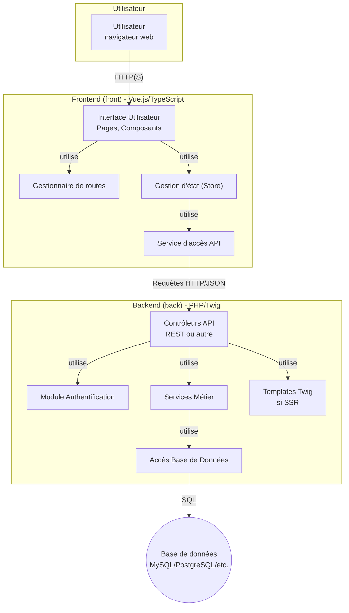
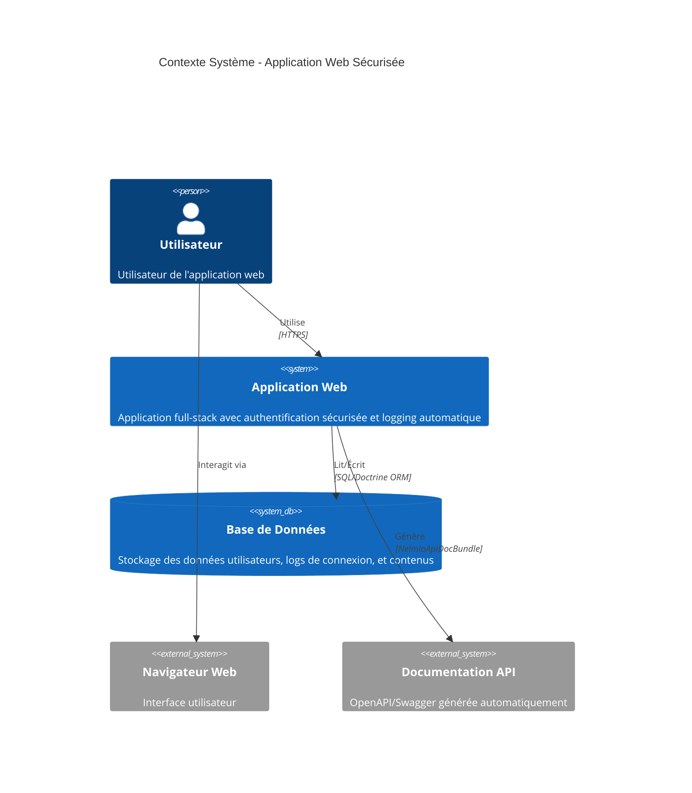
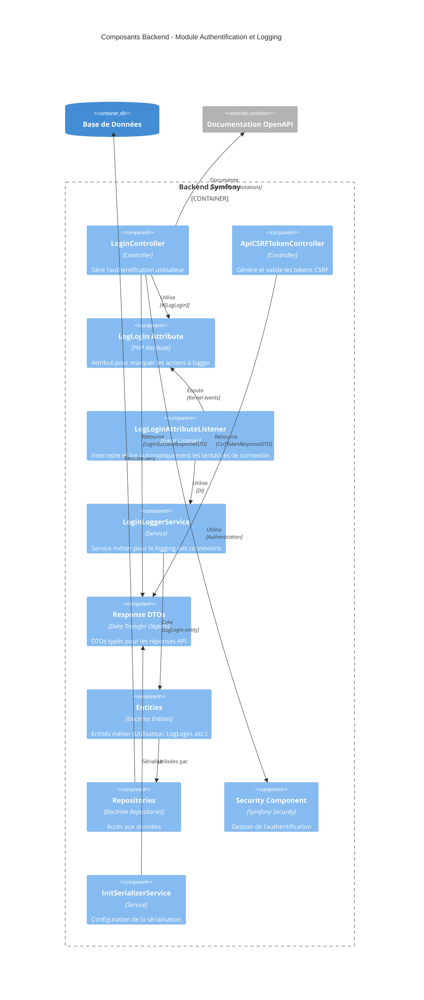
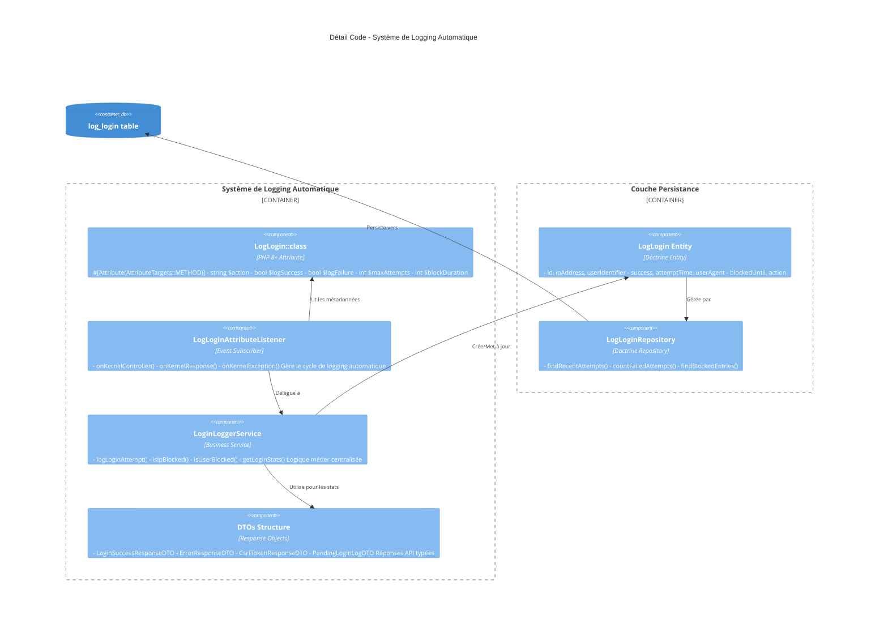
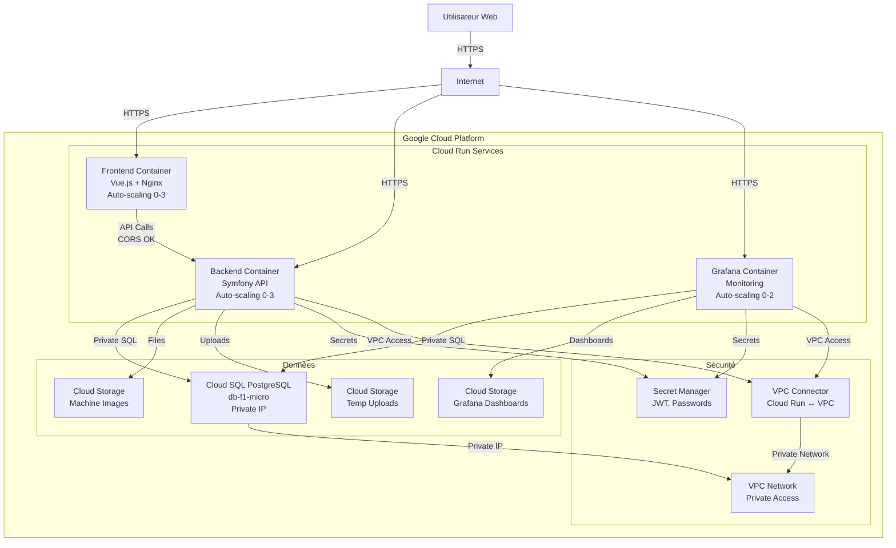
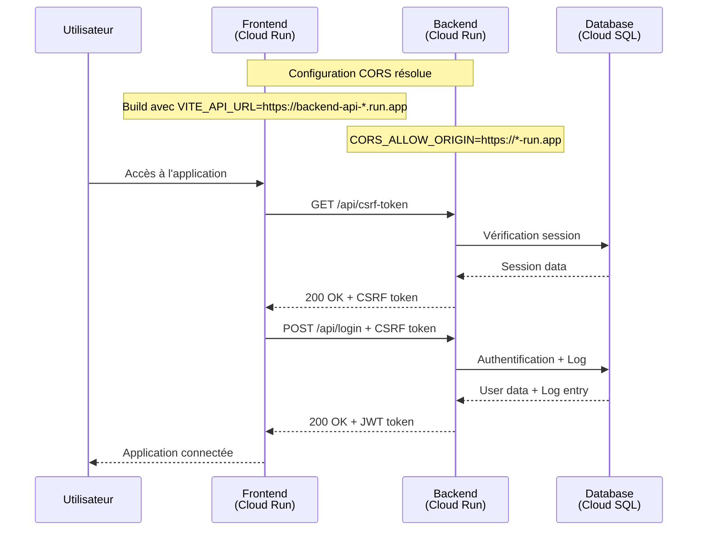
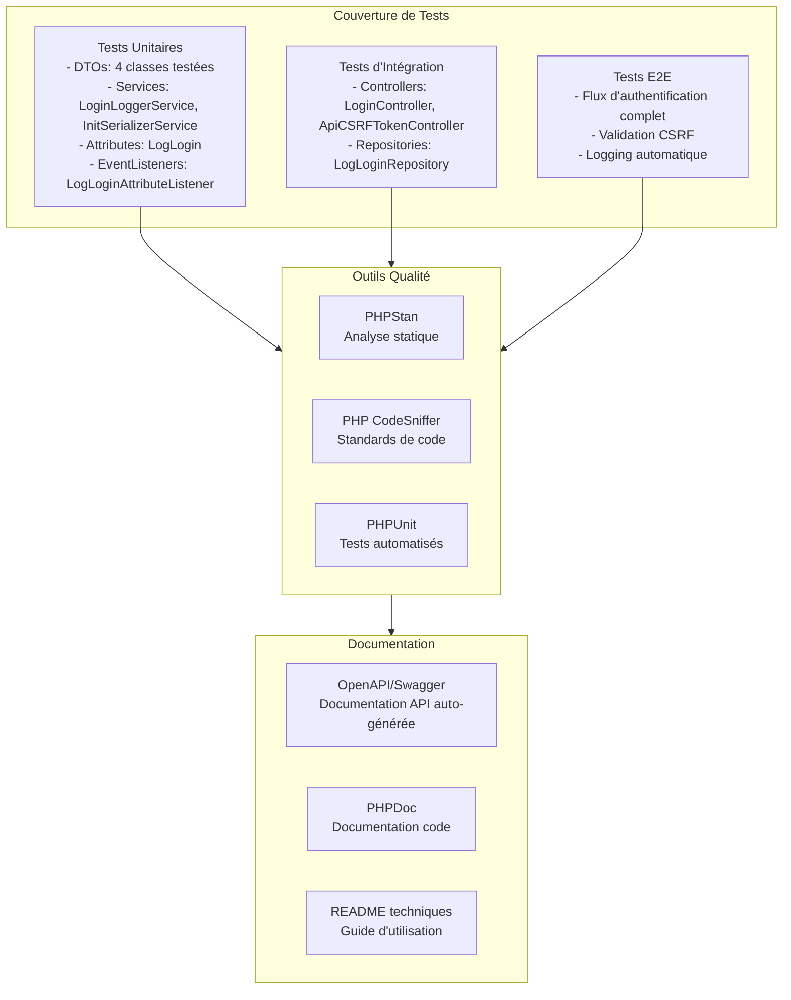
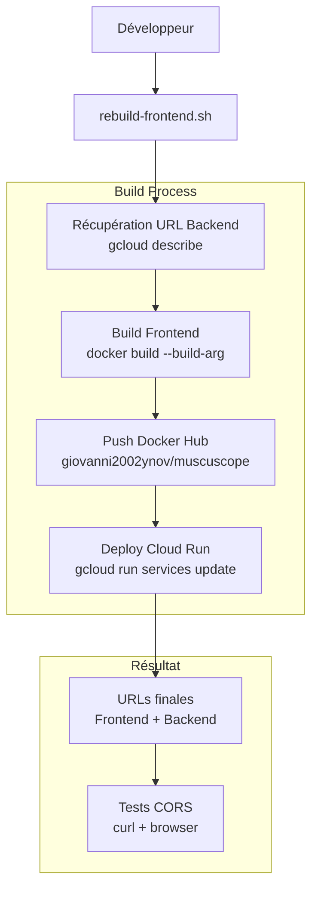

# Schémas des Composants Applicatifs et leurs Interactions - MuscuScope

## 📐 Architecture Générale - Vue d'ensemble

---

## 🏗️ Architecture C4 - Niveau 1 : Contexte Système

---

## 🔧 Architecture C4 - Niveau 3 : Composants Backend

---

## 💻 Architecture C4 - Niveau 4 : Détail du Code

---

## ☁️ Infrastructure Cloud (GCP Cloud Run) - Architecture Déployée

---

## 🔄 Flux d'Authentification et Interactions CORS

---

## 🧪 Tests et Qualité - Couverture des Composants

---

## 🚀 Déploiement et Interactions - Processus Automatisé

