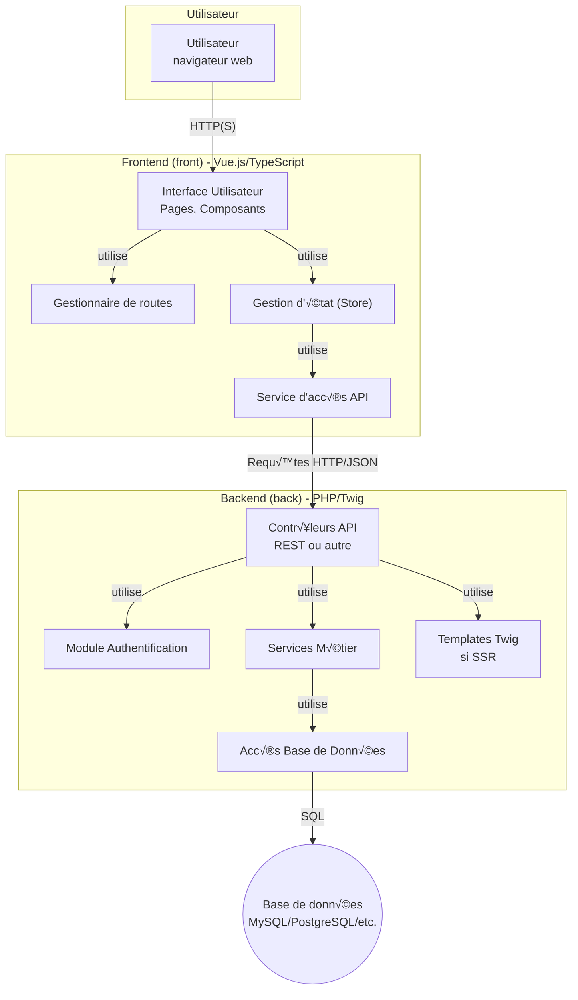
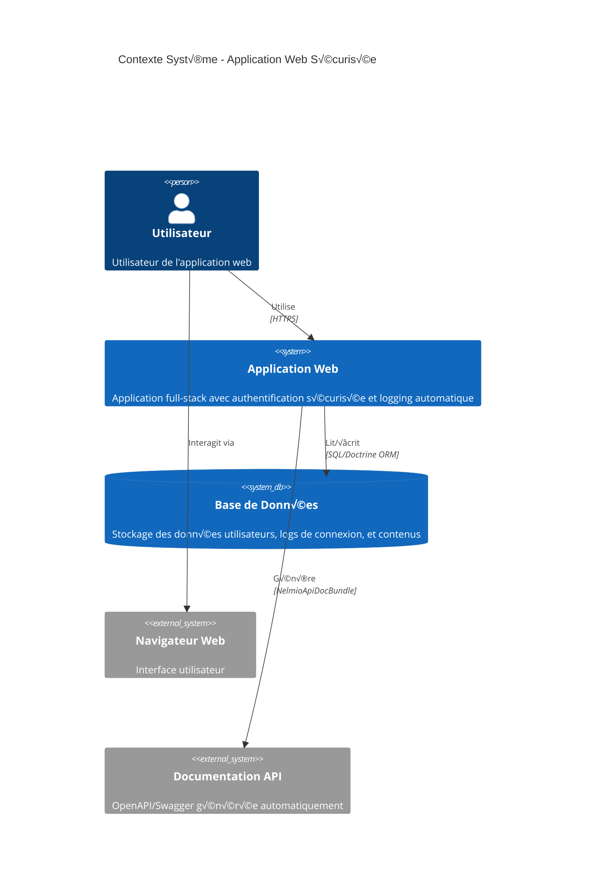
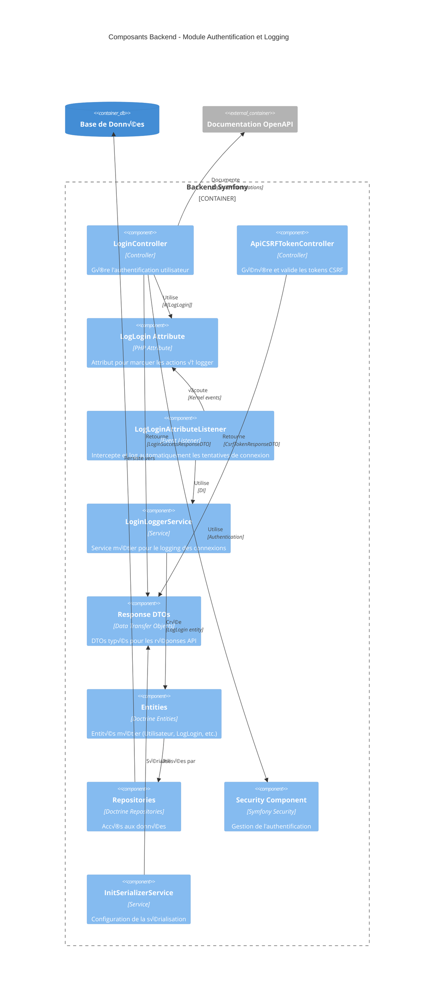
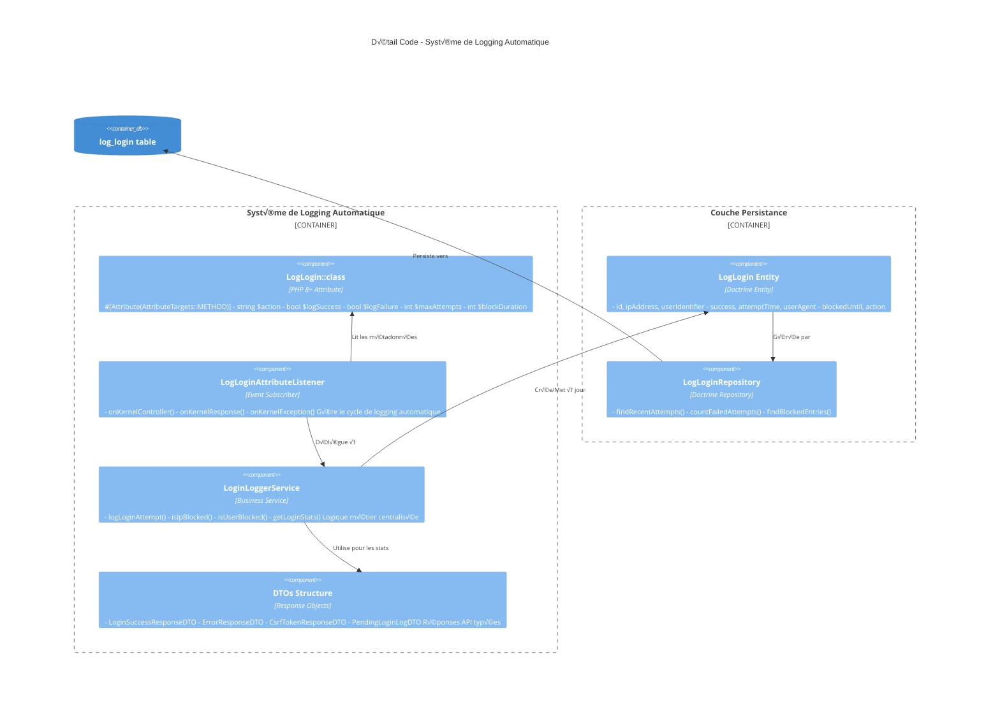
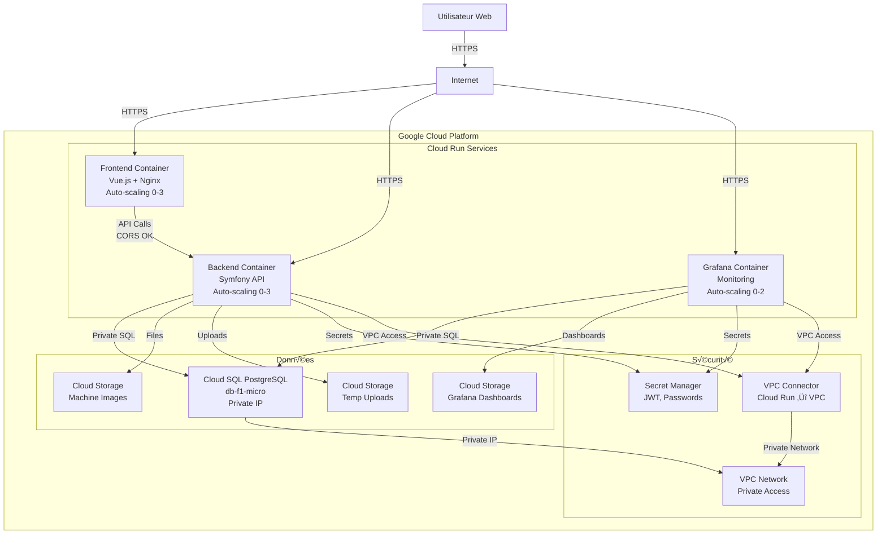

# Schémas des Composants Applicatifs et leurs Interactions - MuscuScope

## 📐 Architecture Générale - Vue d'ensemble

```mermaid
flowchart TD
    subgraph Utilisateur
        U["Utilisateur<br>navigateur web"]
    end

    subgraph Frontend["Frontend (front) - Vue.js/TypeScript"]
        FE_UI["Interface Utilisateur<br>Pages, Composants"]
        FE_Routes["Gestionnaire de routes"]
        FE_API["Service d'accès API"]
        FE_Store["Gestion d'état (Store)"]
    end

    subgraph Backend["Backend (back) - PHP/Twig"]
        BE_API["Contrôleurs API<br>REST ou autre"]
        BE_Auth["Module Authentification"]
        BE_Service["Services Métier"]
        BE_DB["Accès Base de Données"]
        BE_Templates["Templates Twig<br>si SSR"]
    end

    DB(("Base de données<br>MySQL/PostgreSQL/etc."))

    %% Relations Utilisateur
    U -- HTTP(S) --> FE_UI

    %% Relations Front <-> Back
    FE_API -- Requêtes HTTP/JSON --> BE_API
    FE_UI -- utilise --> FE_Routes
    FE_UI -- utilise --> FE_Store
    FE_Store -- utilise --> FE_API

    %% Relations Backend interne
    BE_API -- utilise --> BE_Auth
    BE_API -- utilise --> BE_Service
    BE_Service -- utilise --> BE_DB
    BE_API -- utilise --> BE_Templates

    %% Base de données
    BE_DB -- SQL --> DB
```

---

## 🏗️ Architecture C4 - Niveau 1 : Contexte Système

```mermaid
C4Context
    title Contexte Système - Application Web Sécurisée

    Person(user, "Utilisateur", "Utilisateur de l'application web")
    
    System(webapp, "Application Web", "Application full-stack avec authentification sécurisée et logging automatique")
    
    SystemDb(database, "Base de Données", "Stockage des données utilisateurs, logs de connexion, et contenus")
    
    System_Ext(browser, "Navigateur Web", "Interface utilisateur")
    System_Ext(api_docs, "Documentation API", "OpenAPI/Swagger générée automatiquement")

    Rel(user, webapp, "Utilise", "HTTPS")
    Rel(webapp, database, "Lit/Écrit", "SQL/Doctrine ORM")
    Rel(user, browser, "Interagit via")
    Rel(webapp, api_docs, "Génère", "NelmioApiDocBundle")
```

---

## üîß Architecture C4 - Niveau 3 : Composants Backend

```mermaid
C4Component
    title Composants Backend - Module Authentification et Logging

    Container_Boundary(backend, "Backend Symfony") {
        Component(loginController, "LoginController", "Controller", "Gère l'authentification utilisateur")
        Component(csrfController, "ApiCSRFTokenController", "Controller", "Génère et valide les tokens CSRF")
        
        Component(logLoginAttribute, "LogLogin Attribute", "PHP Attribute", "Attribut pour marquer les actions à logger")
        Component(logLoginListener, "LogLoginAttributeListener", "Event Listener", "Intercepte et log automatiquement les tentatives de connexion")
        Component(loginLoggerService, "LoginLoggerService", "Service", "Service métier pour le logging des connexions")
        
        Component(dtos, "Response DTOs", "Data Transfer Objects", "DTOs typés pour les réponses API")
        Component(entities, "Entities", "Doctrine Entities", "Entités métier (Utilisateur, LogLogin, etc.)")
        Component(repositories, "Repositories", "Doctrine Repositories", "Accès aux données")
        
        Component(security, "Security Component", "Symfony Security", "Gestion de l'authentification")
        Component(serializer, "InitSerializerService", "Service", "Configuration de la sérialisation")
    }

    ContainerDb(database, "Base de Données")
    Container_Ext(docs, "Documentation OpenAPI")

    Rel(loginController, logLoginAttribute, "Utilise", "#[LogLogin]")
    Rel(logLoginListener, loginLoggerService, "Utilise", "DI")
    Rel(loginLoggerService, entities, "Crée", "LogLogin entity")
    Rel(loginController, dtos, "Retourne", "LoginSuccessResponseDTO")
    Rel(csrfController, dtos, "Retourne", "CsrfTokenResponseDTO")
    Rel(loginController, security, "Utilise", "Authentication")
    Rel(entities, repositories, "Utilisées par")
    Rel(repositories, database, "Persiste vers")
    Rel(loginController, docs, "Documente", "OpenAPI annotations")
    Rel(logLoginListener, logLoginAttribute, "Écoute", "Kernel events")
    Rel(serializer, dtos, "Sérialise")
```

---

## 💻 Architecture C4 - Niveau 4 : Détail du Code

```mermaid
C4Component
    title Détail Code - Système de Logging Automatique

    Container_Boundary(logging_system, "Système de Logging Automatique") {
        Component(attribute_def, "LogLogin::class", "PHP 8+ Attribute", "
            #[Attribute(AttributeTargets::METHOD)]
            - string $action
            - bool $logSuccess  
            - bool $logFailure
            - int $maxAttempts
            - int $blockDuration")
        
        Component(listener_impl, "LogLoginAttributeListener", "Event Subscriber", "
            - onKernelController()
            - onKernelResponse()  
            - onKernelException()
            Gère le cycle de logging automatique")
            
        Component(service_impl, "LoginLoggerService", "Business Service", "
            - logLoginAttempt()
            - isIpBlocked()
            - isUserBlocked()
            - getLoginStats()
            Logique métier centralisée")
            
        Component(dto_impl, "DTOs Structure", "Response Objects", "
            - LoginSuccessResponseDTO
            - ErrorResponseDTO  
            - CsrfTokenResponseDTO
            - PendingLoginLogDTO
            Réponses API typées")
    }

    Container_Boundary(persistence, "Couche Persistance") {
        Component(entity_loglogin, "LogLogin Entity", "Doctrine Entity", "
            - id, ipAddress, userIdentifier
            - success, attemptTime, userAgent
            - blockedUntil, action")
        Component(repository_loglogin, "LogLoginRepository", "Doctrine Repository", "
            - findRecentAttempts()
            - countFailedAttempts()
            - findBlockedEntries()")
    }

    ContainerDb(db_table, "log_login table")

    Rel(listener_impl, attribute_def, "Lit les métadonnées")
    Rel(listener_impl, service_impl, "Délègue à")
    Rel(service_impl, entity_loglogin, "Crée/Met à jour")
    Rel(entity_loglogin, repository_loglogin, "Gérée par")
    Rel(repository_loglogin, db_table, "Persiste vers")
    Rel(service_impl, dto_impl, "Utilise pour les stats")
```

---

## ☁️ Infrastructure Cloud (GCP Cloud Run) - Architecture Déployée

```mermaid
flowchart TD
    User[Utilisateur Web]
    Internet[Internet]
    
    subgraph GCP["Google Cloud Platform"]
        subgraph CloudRun["Cloud Run Services"]
            FE[Frontend Container<br/>Vue.js + Nginx<br/>Auto-scaling 0-3]
            BE[Backend Container<br/>Symfony API<br/>Auto-scaling 0-3]
            GR[Grafana Container<br/>Monitoring<br/>Auto-scaling 0-2]
        end
        
        subgraph Data["Données"]
            DB[Cloud SQL PostgreSQL<br/>db-f1-micro<br/>Private IP]
            CS1[Cloud Storage<br/>Machine Images]
            CS2[Cloud Storage<br/>Temp Uploads]
            CS3[Cloud Storage<br/>Grafana Dashboards]
        end
        
        subgraph Security["Sécurité"]
            SM[Secret Manager<br/>JWT, Passwords]
            VPC[VPC Network<br/>Private Access]
            VPCC[VPC Connector<br/>Cloud Run ‚Üî VPC]
        end
    end

    User -- HTTPS --> Internet
    Internet -- HTTPS --> FE
    Internet -- HTTPS --> BE
    Internet -- HTTPS --> GR
    
    FE -- "API Calls<br/>CORS OK" --> BE
    BE -- "Private SQL" --> DB
    GR -- "Private SQL" --> DB
    
    BE -- "Files" --> CS1
    BE -- "Uploads" --> CS2
    GR -- "Dashboards" --> CS3
    
    BE -- "Secrets" --> SM
    GR -- "Secrets" --> SM
    
    BE -- "VPC Access" --> VPCC
    GR -- "VPC Access" --> VPCC
    VPCC -- "Private Network" --> VPC
    DB -- "Private IP" --> VPC
```
