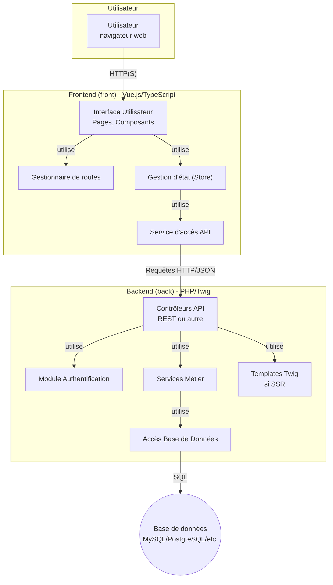
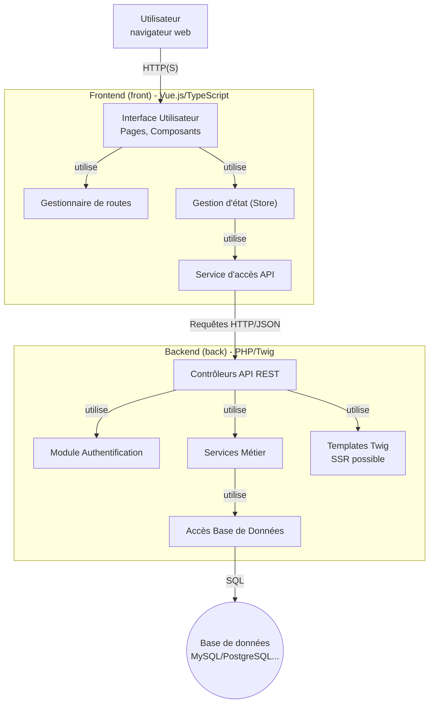
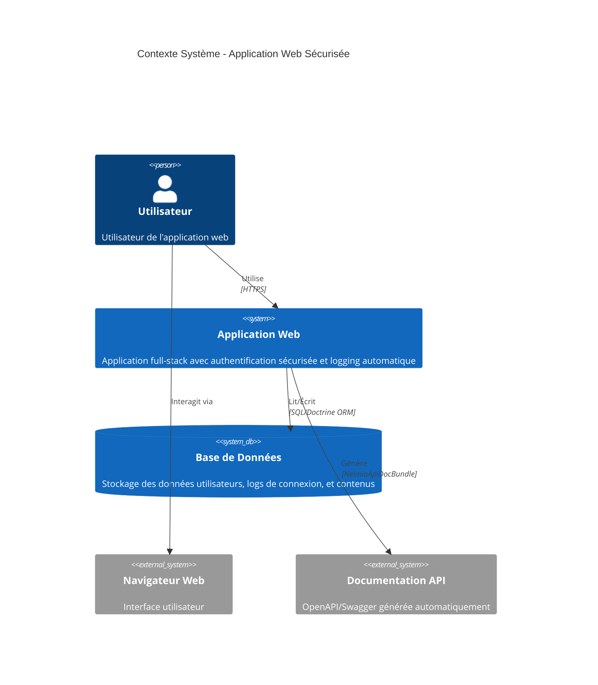
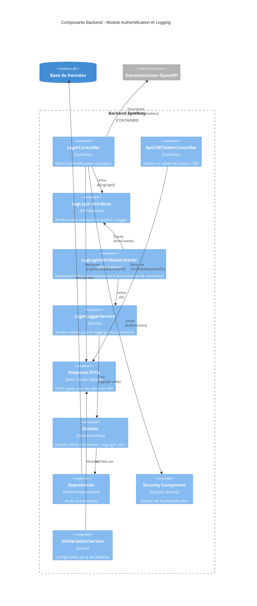
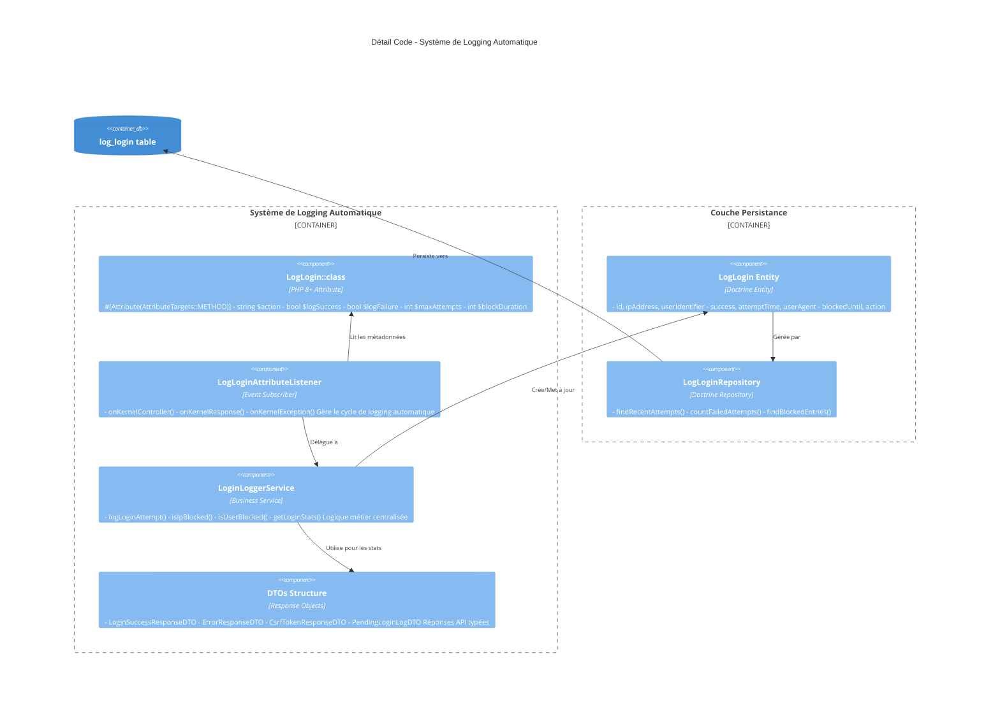
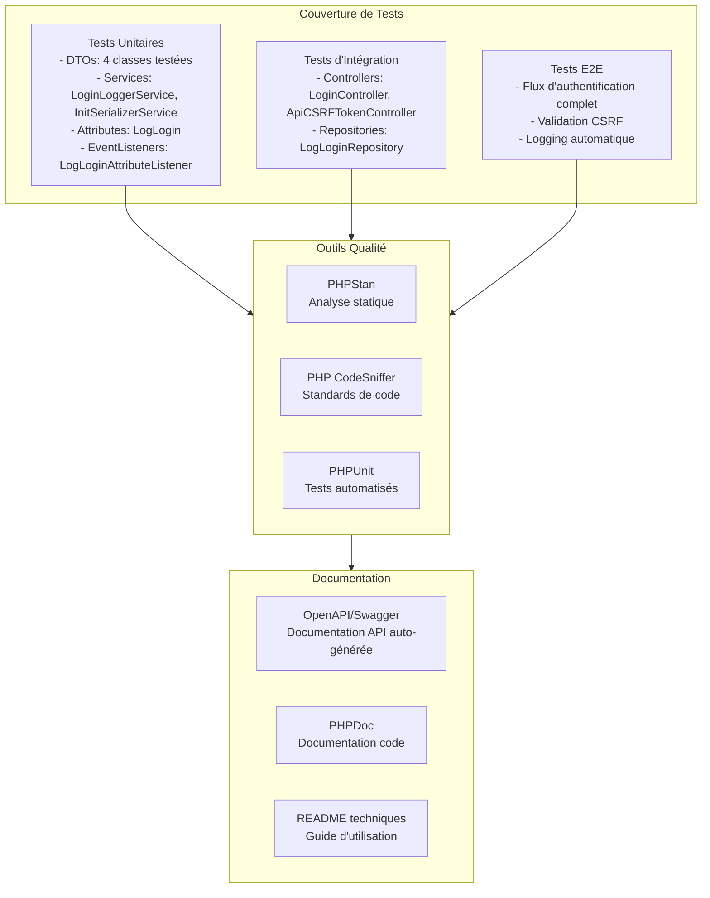

# ?



## Architecture cible



## Modèle C4 - Vue d'ensemble

### Niveau 1 - Context (Contexte Système)



### Niveau 2 - Containers (Conteneurs)

```mermaid
C4Container
    title Conteneurs - Architecture Applicative

    Person(user, "Utilisateur")

    Container_Boundary(webapp, "Application Web") {
        Container(frontend, "Frontend SPA", "Vue.js, TypeScript, Vite", "Interface utilisateur reactive")
        Container(backend, "Backend API", "PHP 8.3, Symfony 7.3", "API REST avec auth et logging")
        Container(webserver, "Serveur Web", "Nginx/Apache", "Reverse proxy et assets statiques")
    }

    ContainerDb(database, "Base de Données", "MySQL/PostgreSQL", "Persistance des données")
    
    Container_Ext(docs, "Documentation", "OpenAPI/Swagger UI", "Documentation API auto-générée")

    Rel(user, frontend, "Utilise", "HTTPS")
    Rel(frontend, backend, "Appelle", "JSON/HTTPS, CSRF protected")
    Rel(backend, database, "Persiste", "Doctrine ORM")
    RelIndex(backend, docs, "Génère", "4")
    Rel(webserver, frontend, "Sert", "Assets statiques")
    Rel(webserver, backend, "Proxy vers", "FastCGI/FPM")
```

### Niveau 3 - Components (Composants Backend)



### Niveau 4 - Code (Détail d'implémentation)



## Tests et Qualité


