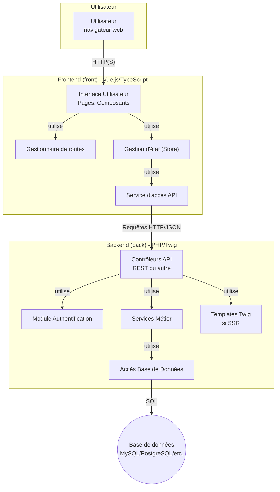
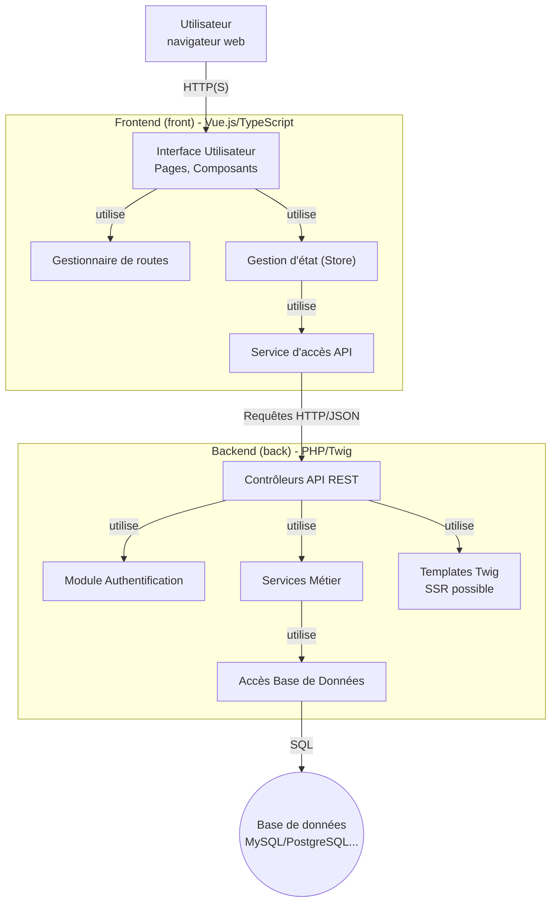
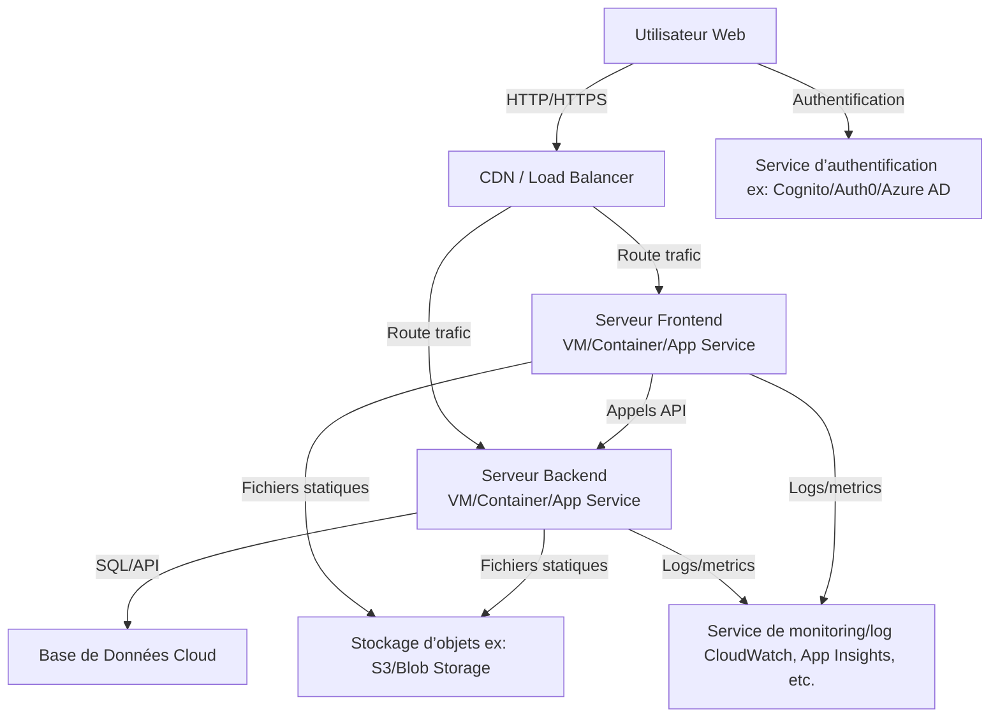
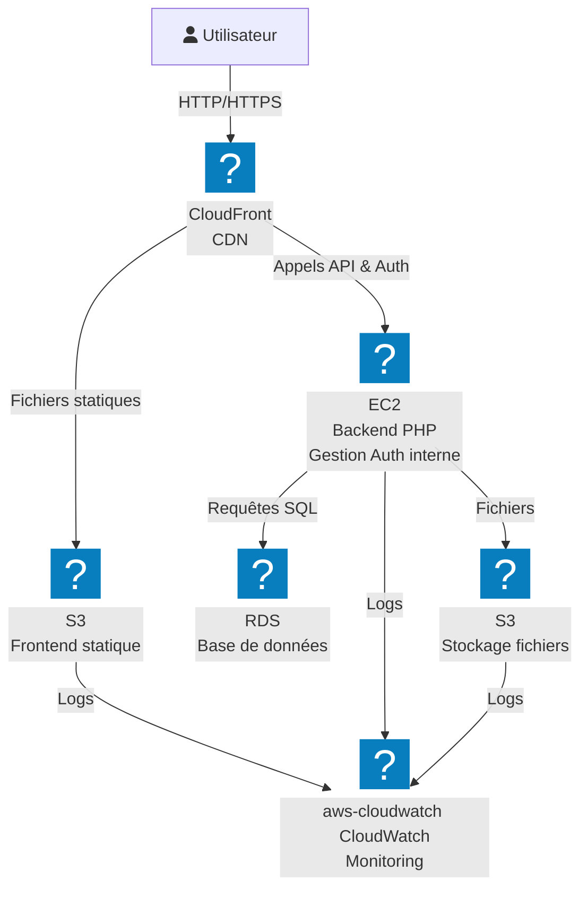
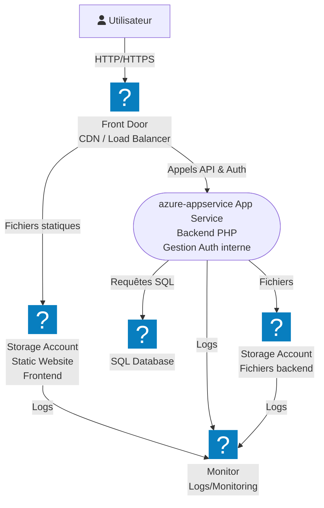

# ?

```mermaid
flowchart TD
    subgraph Utilisateur
        U["Utilisateur<br>navigateur web"]
    end

    subgraph Frontend["Frontend (front) - Vue.js/TypeScript"]
        FE_UI["Interface Utilisateur<br>Pages, Composants"]
        FE_Routes["Gestionnaire de routes"]
        FE_API["Service d'accès API"]
        FE_Store["Gestion d'état (Store)"]
    end

    subgraph Backend["Backend (back) - PHP/Twig"]
        BE_API["Contrôleurs API<br>REST ou autre"]
        BE_Auth["Module Authentification"]
        BE_Service["Services Métier"]
        BE_DB["Accès Base de Données"]
        BE_Templates["Templates Twig<br>si SSR"]
    end

    DB(("Base de données<br>MySQL/PostgreSQL/etc."))

    %% Relations Utilisateur
    U -- HTTP(S) --> FE_UI

    %% Relations Front <-> Back
    FE_API -- Requêtes HTTP/JSON --> BE_API
    FE_UI -- utilise --> FE_Routes
    FE_UI -- utilise --> FE_Store
    FE_Store -- utilise --> FE_API

    %% Relations Backend interne
    BE_API -- utilise --> BE_Auth
    BE_API -- utilise --> BE_Service
    BE_Service -- utilise --> BE_DB
    BE_API -- utilise --> BE_Templates

    %% Base de données
    BE_DB -- SQL --> DB
```

## Architecture cible

```mermaid
flowchart TD
    U["Utilisateur<br>navigateur web"]
    
    subgraph Frontend ["Frontend (front) - Vue.js/TypeScript"]
        FE_UI["Interface Utilisateur<br>Pages, Composants"]
        FE_Routes["Gestionnaire de routes"]
        FE_API["Service d'accès API"]
        FE_Store["Gestion d'état (Store)"]
    end

    subgraph Backend ["Backend (back) - PHP/Twig"]
        BE_API["Contrôleurs API REST"]
        BE_Auth["Module Authentification"]
        BE_Service["Services Métier"]
        BE_DB["Accès Base de Données"]
        BE_Templates["Templates Twig<br>SSR possible"]
    end

    DB(("Base de données<br>MySQL/PostgreSQL..."))

    %% Utilisateur vers Frontend
    U -- HTTP(S) --> FE_UI

    %% Frontend interne
    FE_UI -- utilise --> FE_Routes
    FE_UI -- utilise --> FE_Store
    FE_Store -- utilise --> FE_API

    %% Frontend vers Backend
    FE_API -- Requêtes HTTP/JSON --> BE_API

    %% Backend interne
    BE_API -- utilise --> BE_Auth
    BE_API -- utilise --> BE_Service
    BE_Service -- utilise --> BE_DB
    BE_API -- utilise --> BE_Templates

    %% Backend vers DB
    BE_DB -- SQL --> DB

```

## Infrastructure Cloud (exemple)

```mermaid
flowchart TD
    User[Utilisateur Web]
    CDN[CDN / Load Balancer]
    FE[Serveur Frontend<br/>VM/Container/App Service]
    BE[Serveur Backend<br/>VM/Container/App Service]
    DB[Base de Données Cloud]
    Storage[Stockage d’objets ex: S3/Blob Storage]
    Auth[Service d’authentification ex: Cognito/Auth0/Azure AD]
    Monitor[Service de monitoring/log CloudWatch, App Insights, etc.]

    User -- HTTP/HTTPS --> CDN
    CDN -- Route trafic --> FE
    CDN -- Route trafic --> BE
    FE -- Appels API --> BE
    BE -- SQL/API --> DB
    FE -- Fichiers statiques --> Storage
    BE -- Fichiers statiques --> Storage
    User -- Authentification --> Auth
    BE -- Logs/metrics --> Monitor
    FE -- Logs/metrics --> Monitor
```

## Infrastructure cloud cible (AWS, Auth gérée en interne)

```mermaid
flowchart TD
    A[fa:fa-user Utilisateur]

    CF[CloudFront<br/>CDN]
    S3F([S3<br/>Frontend statique])
    EC2([EC2<br/>Backend PHP<br/>Gestion Auth interne])
    RDS([RDS<br/>Base de données])
    S3([S3<br/>Stockage fichiers])
    CloudWatch([aws-cloudwatch CloudWatch<br/>Monitoring])

    A -- "HTTP/HTTPS" --> CF
    CF -- "Fichiers statiques" --> S3F
    CF -- "Appels API & Auth" --> EC2
    S3F -- "Logs" --> CloudWatch
    EC2 -- "Requêtes SQL" --> RDS
    EC2 -- "Fichiers" --> S3
    EC2 -- "Logs" --> CloudWatch
    S3 -- "Logs" --> CloudWatch


    CF@{ icon: "aws:arch-amazon-cloudfront", pos: "b"}
    S3F@{ icon: "aws:arch-amazon-simple-storage-service", pos: "b"}
    S3@{ icon: "aws:arch-amazon-simple-storage-service", pos: "b"}
    EC2@{ icon: "aws:ec2-instance-contents", pos: "b"}
    RDS@{ icon: "aws:arch-amazon-elastic-block-store", pos: "b"}
    CloudWatch@{ icon: "aws:arch-amazon-cloudwatch", pos: "b"}
```

## Infrastructure cloud cible (Azure, avec icônes)

```mermaid
flowchart TD
    A[fa:fa-user Utilisateur]

    AF([Front Door<br/>CDN / Load Balancer])
    STAF([Storage Account<br/>Static Website<br/>Frontend])
    WA([azure-appservice App Service<br/>Backend PHP<br/>Gestion Auth interne])
    SQL([SQL Database])
    ST([Storage Account<br/>Fichiers backend])
    Monitor([Monitor<br/>Logs/Monitoring])

    %% Relations
    A -- "HTTP/HTTPS" --> AF
    AF -- "Fichiers statiques" --> STAF
    AF -- "Appels API & Auth" --> WA
    STAF -- "Logs" --> Monitor
    WA -- "Requêtes SQL" --> SQL
    WA -- "Fichiers" --> ST
    WA -- "Logs" --> Monitor
    ST -- "Logs" --> Monitor

    AF@{ icon: "azure:front-door-and-cdn-profiles", pos: "b"}
    STAF@{ icon: "azure:storage-accounts-classic", pos: "b"}
    WA@{ icon: "", pos: "b"}
    SQL@{ icon: "azure:arc-postgresql", pos: "b"}
    ST@{ icon: "azure:storage-accounts-classic", pos: "b"}
    Monitor@{ icon: "azure:monitor", pos: "b"}
```
