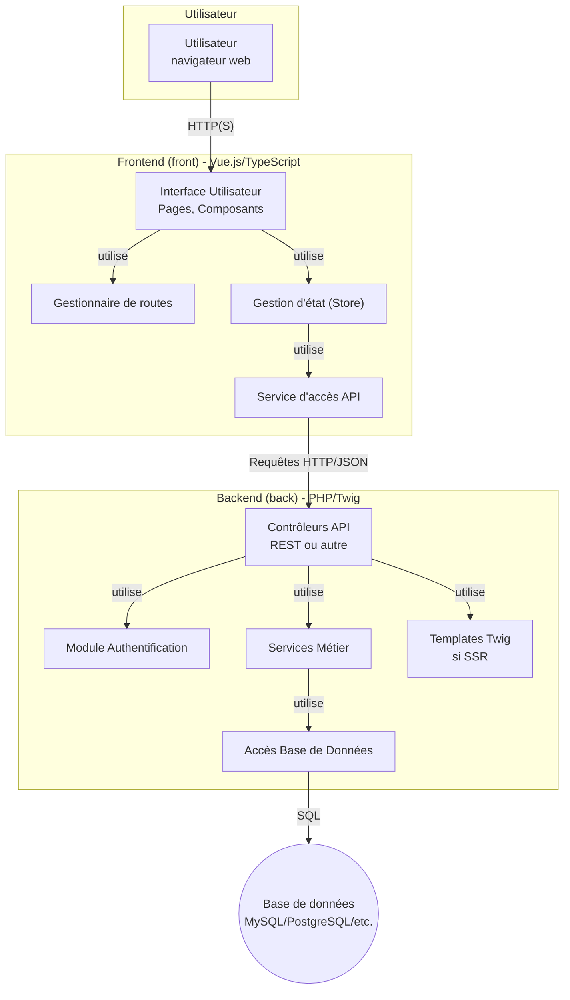
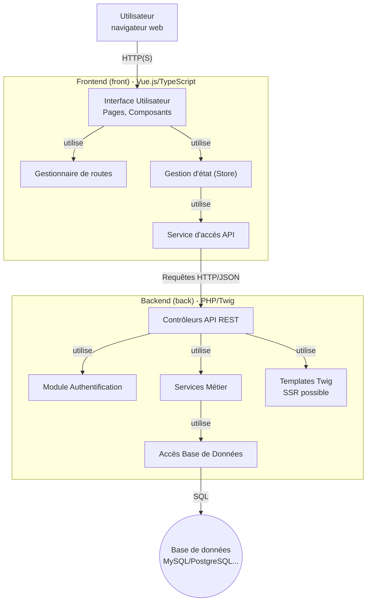

# ?

```mermaid
flowchart TD
    subgraph Utilisateur
        U["Utilisateur<br>navigateur web"]
    end

    subgraph Frontend["Frontend (front) - Vue.js/TypeScript"]
        FE_UI["Interface Utilisateur<br>Pages, Composants"]
        FE_Routes["Gestionnaire de routes"]
        FE_API["Service d'accès API"]
        FE_Store["Gestion d'état (Store)"]
    end

    subgraph Backend["Backend (back) - PHP/Twig"]
        BE_API["Contrôleurs API<br>REST ou autre"]
        BE_Auth["Module Authentification"]
        BE_Service["Services Métier"]
        BE_DB["Accès Base de Données"]
        BE_Templates["Templates Twig<br>si SSR"]
    end

    DB(("Base de données<br>MySQL/PostgreSQL/etc."))

    %% Relations Utilisateur
    U -- HTTP(S) --> FE_UI

    %% Relations Front <-> Back
    FE_API -- Requêtes HTTP/JSON --> BE_API
    FE_UI -- utilise --> FE_Routes
    FE_UI -- utilise --> FE_Store
    FE_Store -- utilise --> FE_API

    %% Relations Backend interne
    BE_API -- utilise --> BE_Auth
    BE_API -- utilise --> BE_Service
    BE_Service -- utilise --> BE_DB
    BE_API -- utilise --> BE_Templates

    %% Base de données
    BE_DB -- SQL --> DB
```

## Architecture cible

```mermaid
flowchart TD
    U["Utilisateur<br>navigateur web"]
    
    subgraph Frontend ["Frontend (front) - Vue.js/TypeScript"]
        FE_UI["Interface Utilisateur<br>Pages, Composants"]
        FE_Routes["Gestionnaire de routes"]
        FE_API["Service d'accès API"]
        FE_Store["Gestion d'état (Store)"]
    end

    subgraph Backend ["Backend (back) - PHP/Twig"]
        BE_API["Contrôleurs API REST"]
        BE_Auth["Module Authentification"]
        BE_Service["Services Métier"]
        BE_DB["Accès Base de Données"]
        BE_Templates["Templates Twig<br>SSR possible"]
    end

    DB(("Base de données<br>MySQL/PostgreSQL..."))

    %% Utilisateur vers Frontend
    U -- HTTP(S) --> FE_UI

    %% Frontend interne
    FE_UI -- utilise --> FE_Routes
    FE_UI -- utilise --> FE_Store
    FE_Store -- utilise --> FE_API

    %% Frontend vers Backend
    FE_API -- Requêtes HTTP/JSON --> BE_API

    %% Backend interne
    BE_API -- utilise --> BE_Auth
    BE_API -- utilise --> BE_Service
    BE_Service -- utilise --> BE_DB
    BE_API -- utilise --> BE_Templates

    %% Backend vers DB
    BE_DB -- SQL --> DB

```
