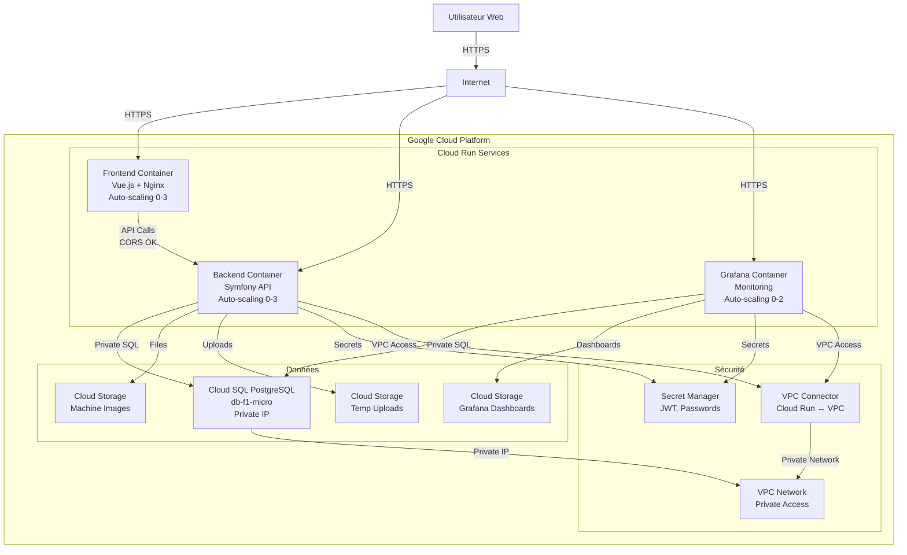
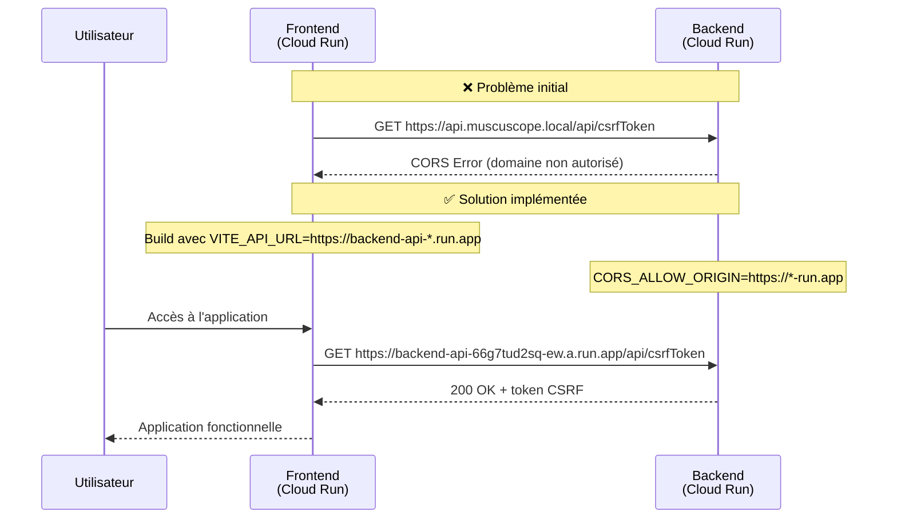
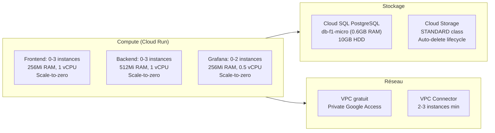
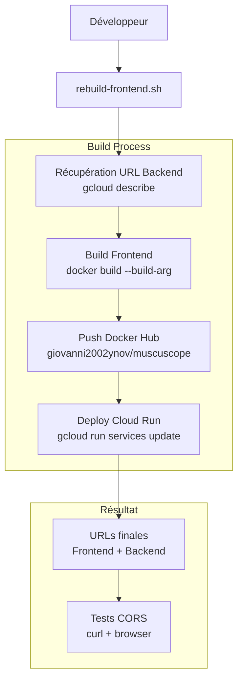
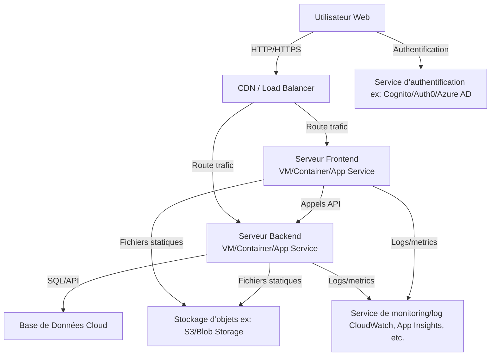
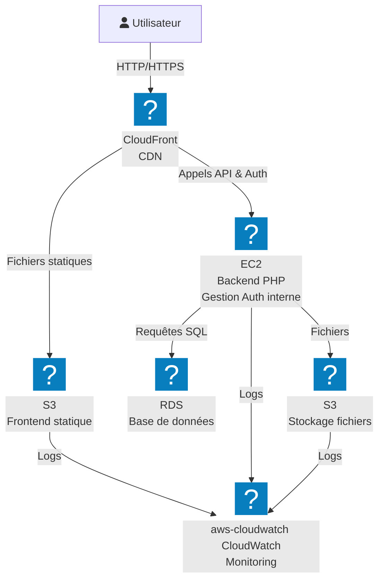
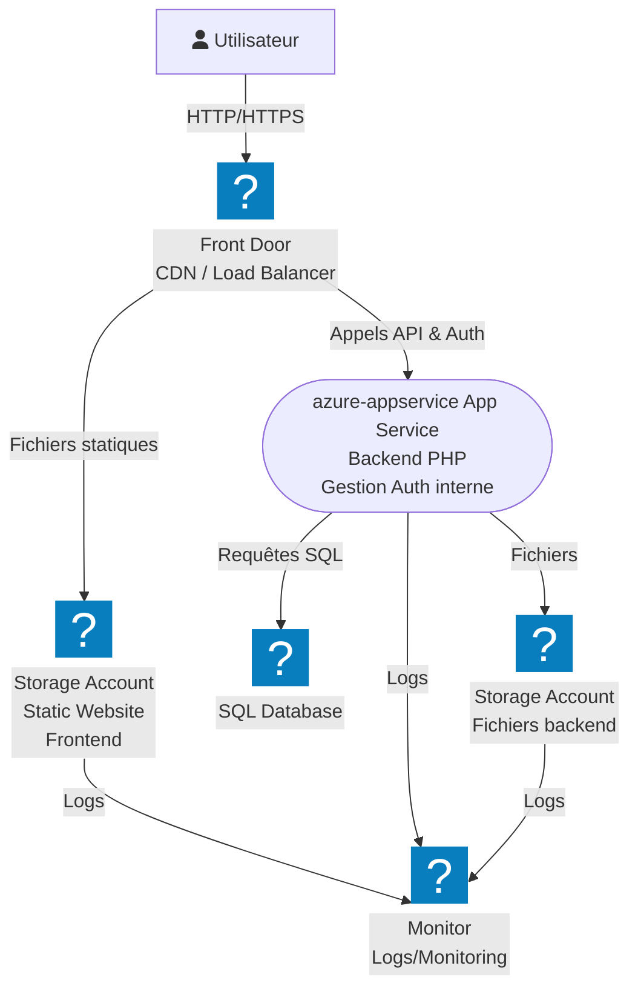

# Infrastructure Cloud - MuscuScope (GCP Cloud Run)

## Architecture actuelle déployée

## Résolution du problème CORS

## Infrastructure économique (Coûts ~30-50€/mois)

## Déploiement automatisé

## Infrastructure cloud cible (AWS, Auth gérée en interne)

## Infrastructure cloud cible (Azure, avec icônes)

